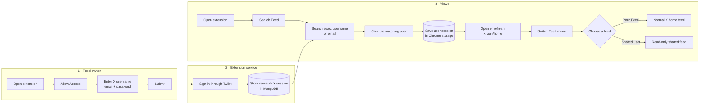
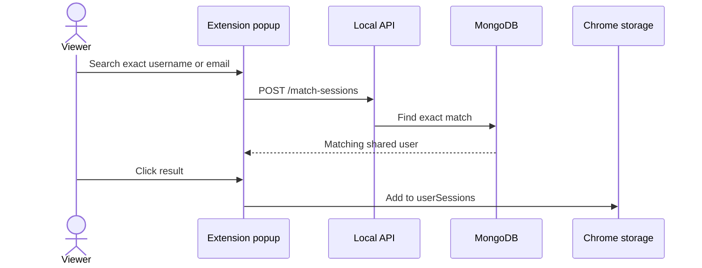
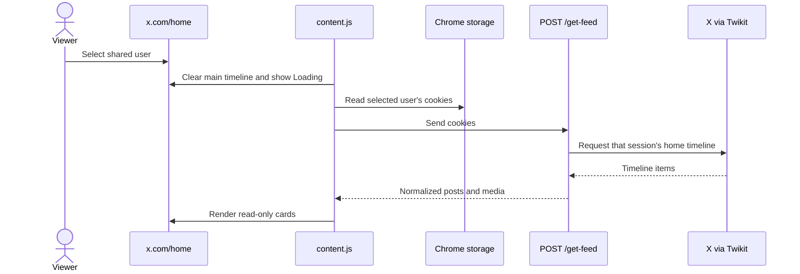
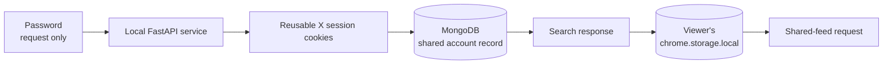

# X Feed Extension

A Chrome extension prototype that lets one person grant another person read-only access to view their X home timeline.

> [!IMPORTANT]
> “Shared feed” means the account owner’s **X Home timeline**: the posts X normally shows that account. It does not mean only the posts published by that account.

## Complete flow



The owner completes **Allow Access**. The viewer completes **Search Feed** and **Switch Feed**. These can be different people using different browser installations, as long as both extensions use the same backend and MongoDB database.

## What the viewer can do

| Action | Your Feed | Shared Feed |
| --- | :---: | :---: |
| Read posts | Yes | Yes |
| View images and videos | Yes | Yes |
| See like, repost, and reply counts | Yes | Yes |
| Like, reply, or repost from the injected view | Yes, through normal X | **No** |
| Switch to another saved feed | Yes | Yes |

The shared timeline is rendered as custom cards. Those cards contain no like, reply, or repost controls. Selecting **Your Feed** reloads X and restores the normal timeline.

## Use the extension

### 1. Install and open it

Build the extension, load `extension/dist` from `chrome://extensions`, and click the extension icon. The popup shows:

```text
┌──────────────────────────────┐
│         Hello X User         │
│                              │
│  [ Search Feed ] [Allow Access]
└──────────────────────────────┘
```

For local installation commands, see [Setup](docs/setup.md).

### 2. The owner grants access

The account owner chooses **Allow Access**, enters their X username, email, and password, then selects **Submit**.

```text
Owner input
    │
    ├─ username ─┐
    ├─ email ────┼─> POST /login ─> X login ─> session cookies ─> MongoDB
    └─ password ─┘
```

The backend uses the details to create an X session. It stores the resulting session cookies, not the password, in MongoDB. A success message means the saved account can now be found by a viewer.

### 3. The viewer adds the shared user

The viewer opens the extension, chooses **Search Feed**, and searches using the exact username or email entered by the owner.



Searching only displays the match. **Clicking the result is what adds it** to the viewer’s browser. Duplicate users are not added twice.

### 4. Open X Home and switch feeds

Open `https://x.com/home`. A **Switch Feed** control appears at the top-right:

```text
                                              ┌────────────────────────┐
                                              │ 👤 Switch Feed:        │
                                              │ [Your Feed          ▾] │
                                              │  Your Feed             │
                                              │  shared_user_1         │
                                              │  shared_user_2         │
                                              └────────────────────────┘
```

- Choose a saved username to replace X’s main timeline column with that user’s shared home feed.
- Choose **Your Feed** to reload the page and restore the viewer’s own timeline.
- Repeat the selection at any time to move between saved feeds.
- If a user was added while X Home was already open, refresh the page to update the menu.

### 5. What happens when a shared feed is selected



The backend requests 20 timeline items. The page renderer supports up to 30 and displays them in batches of 10 as the viewer scrolls. Each card can contain post text, author, time, media, and engagement counts.

## Where data is stored



| Location | Stored data | Purpose |
| --- | --- | --- |
| MongoDB `twitter_sessions.sessions` | Username, email, session cookies | Makes a granted account searchable |
| Viewer’s `chrome.storage.local` | Selected username and session cookies | Populates the Switch Feed menu |
| Temporary backend file | Login cookies | Read during login, then deletion is attempted |
| Source/database | Password | **Not intentionally persisted by this code** |

## Current boundaries

> [!CAUTION]
> This is a local prototype, not a production-safe delegation system. It transfers and stores reusable X session cookies, exposes unauthenticated local API endpoints, and uses Twikit rather than an official scoped authorization flow. Use only dedicated test accounts or accounts whose owners have given explicit informed consent.

- The shared view is read-only at the UI level because it renders no interaction buttons.
- The prototype does not enforce a secure viewer identity or permission scope at the backend.
- Search is an exact match against the stored username or email; it is not a partial user-directory search.
- The backend must be running at `http://localhost:8000` whenever access, search, or feed loading is used.
- An expired or invalid shared session is removed from the viewer’s saved list after a failed/empty feed response. The owner must grant access again.
- X or Twikit changes can break login, timeline retrieval, or page injection.

Read [Security and privacy](docs/security-and-privacy.md) before testing with any account.

## Documentation

| Guide | Covers |
| --- | --- |
| [Setup](docs/setup.md) | Backend, database, build, Chrome installation, and verification |
| [Workflow and background processing](docs/workflows-and-api.md) | Every user step and what the system does behind it |
| [Architecture](docs/architecture.md) | Components, storage, and runtime connections |
| [Security and privacy](docs/security-and-privacy.md) | Credential/session risks, consent, cleanup, and production gaps |
| [Troubleshooting](docs/troubleshooting.md) | Failure paths for setup, search, and feed switching |

## Technology

| Layer | Technology |
| --- | --- |
| Browser extension | Chrome Manifest V3, HTML, CSS, JavaScript |
| Build | Webpack and Babel |
| Backend | FastAPI and Uvicorn |
| X client | Twikit |
| Shared storage | MongoDB and Motor |
| Viewer storage | `chrome.storage.local` |

This project is not affiliated with or endorsed by X Corp.
