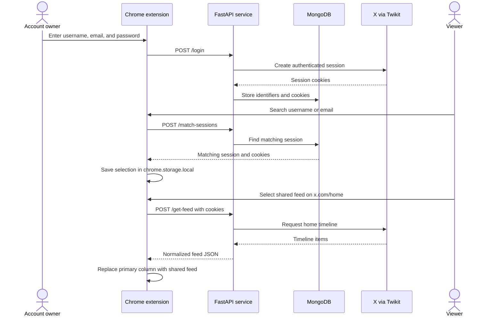

# X Feed Extension

> A consent-based research prototype for viewing a shared X (formerly Twitter) home feed through a Chrome extension.

Built as a GDSC IIT Roorkee project, X Feed Extension combines a Manifest V3 browser extension, a FastAPI service, Twikit, and MongoDB. A user can voluntarily create a reusable X session, another user can locate that shared session, and the extension can render the corresponding timeline inside `x.com/home`.

[Watch the original demo video](https://drive.google.com/file/d/1kaC_B0NBTRkO7f37G3d7zcF8YydUI07B/view?usp=sharing)

## Important safety notice

This repository is an educational prototype—not a production authentication or account-sharing system. It accepts an X password, persists session cookies in MongoDB, copies cookies into Chrome local storage, exposes an unauthenticated local API, and requests broad host access. Session cookies can provide account access and must be treated like passwords.

Only run the project with test accounts or with the account owner's explicit, informed consent. Do not deploy the current backend publicly. Read [Security and privacy](docs/security-and-privacy.md) before running it.

## What it demonstrates

- A Chrome Manifest V3 popup with separate **Allow Access** and **Search Feed** journeys.
- Twikit-based login and timeline retrieval through FastAPI.
- MongoDB-backed storage and lookup of shared sessions.
- Chrome local storage for sessions selected by the viewer.
- A feed switcher injected only on `https://x.com/home`.
- Rendering text, images, video, timestamps, likes, reposts, and replies.
- Batched feed rendering with an intersection observer.
- Automatic removal of a locally selected session when feed retrieval returns no content.

## How the prototype works



## Documentation

| Guide | Covers |
| --- | --- |
| [Architecture](docs/architecture.md) | Components, boundaries, storage, and runtime topology |
| [Setup](docs/setup.md) | Prerequisites, environment, backend, extension build, and loading |
| [Workflows and API](docs/workflows-and-api.md) | User journeys, endpoint contracts, and extension behavior |
| [Security and privacy](docs/security-and-privacy.md) | Sensitive data, current risks, consent, and hardening priorities |
| [Troubleshooting](docs/troubleshooting.md) | Common installation, session, X page, and build problems |

## Repository layout

```text
X_feed_extension/
├── extension/
│   ├── public/
│   │   ├── icon.png
│   │   └── manifest.json
│   ├── src/
│   │   ├── main.*             # Popup landing screen
│   │   ├── allow-access.*     # Session creation screen
│   │   ├── search-feed.*      # Shared-session lookup screen
│   │   ├── content.js         # X home-page feed switcher and renderer
│   │   └── background.js      # Extension installation/action listener
│   ├── dist/                  # Generated unpacked-extension build
│   ├── package.json
│   └── webpack.config.js
├── twikit/
│   ├── models/
│   │   └── session_model.py
│   ├── main.py                # FastAPI application
│   └── requirements.txt
└── docs/
```

## Technology

| Layer | Technology |
| --- | --- |
| Browser client | Chrome Extension Manifest V3, HTML, CSS, JavaScript |
| Extension build | Webpack 5, Babel, HTML Webpack Plugin, Copy Webpack Plugin |
| Backend | Python, FastAPI, Uvicorn, Pydantic |
| X client | Twikit |
| Persistence | MongoDB through Motor |
| Browser persistence | `chrome.storage.local` |

## Current capabilities and limits

| Capability | Status |
| --- | --- |
| Extension popup navigation | Implemented |
| X login through local backend | Implemented, but handles sensitive credentials |
| MongoDB session persistence | Implemented |
| Search by exact username or email | Implemented |
| Shared-feed selection | Implemented |
| Text, image, and MP4 rendering | Implemented |
| X home-feed injection | Implemented against the current selector in the code |
| Backend authentication/authorization | Not implemented |
| Encryption of cookies at rest | Not implemented |
| Secure production deployment | Not implemented |
| Automated tests | Not included |
| Chrome Web Store packaging | Not included |
| Resilience to future X DOM/API changes | Not guaranteed |

## Quick start

### Prerequisites

- Python 3.10 or newer
- Node.js and npm
- Google Chrome or another Chromium browser
- A MongoDB connection string
- A test X account or explicit permission from the participating account owner

### 1. Configure the backend

Create `twikit/.env`:

```dotenv
MONGODB_URI=mongodb://127.0.0.1:27017
```

The `.gitignore` excludes `*.env` files. Never commit a real MongoDB URI.

### 2. Start FastAPI

```bash
cd twikit
python -m venv .venv
source .venv/bin/activate
pip install -r requirements.txt
uvicorn main:app --reload
```

The extension expects the API at `http://localhost:8000`.

### 3. Build the extension

In another terminal:

```bash
cd extension
npm install
npm run build
```

### 4. Load the unpacked extension

1. Open `chrome://extensions`.
2. Enable **Developer mode**.
3. Choose **Load unpacked**.
4. Select `extension/dist`.
5. Keep the FastAPI server running while using the extension.

See [Setup](docs/setup.md) for verification and platform-specific details.

## Main user journeys

### Allow access

The account owner opens the popup, chooses **Allow Access**, and submits their X identifiers and password. The backend logs in through Twikit, temporarily creates a local cookie file, stores the resulting cookies in MongoDB, and then attempts to delete the temporary file.

### Find a shared feed

The viewer chooses **Search Feed** and enters an exact username or email. Selecting a result copies that session into the extension's local storage.

### Switch the displayed feed

On `x.com/home`, the content script adds a **Switch Feed** selector. Choosing a stored user asks the backend for their timeline and replaces X's primary column with the normalized results. Choosing **Your Feed** reloads the page.

## API summary

| Method | Path | Purpose |
| --- | --- | --- |
| `POST` | `/login` | Authenticate through Twikit and store a session |
| `POST` | `/match-sessions` | Find sessions by exact username or email |
| `POST` | `/get-feed` | Retrieve a timeline using supplied cookies |
| `POST` | `/login-from-file/{username}` | Import a cookie file; development-oriented endpoint |

Detailed request and response shapes are in [Workflows and API](docs/workflows-and-api.md).

## Contributors and repository governance

This project was created under **GDSC IIT Roorkee** by:

- **Sidheshwar Sarangal** — project owner and maintainer
- **Ayan** (`AyanMhd` on GitHub and `maniac` in the Git author metadata) — contributor

`GDSC-IITR` remains listed by GitHub as a repository collaborator. An active owner-only branch ruleset prevents non-owner accounts from creating, updating, or deleting branches while preserving collaborator status and historical attribution.

The Git commit history remains the authoritative record of individual contributions. Contributor attribution should not be removed when repository access changes.

Direct branch and code changes are controlled by the owner. Other contributors can retain attribution and participate through discussion, issues, forks, or proposed changes reviewed by the owner; historical authorship does not require direct branch access.

## Project status

The core demonstration workflow is present in the repository. It should be treated as a local research prototype because its present session-sharing and API security model is not suitable for public or production use.

This project is not affiliated with or endorsed by X Corp.
