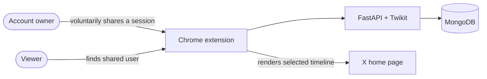
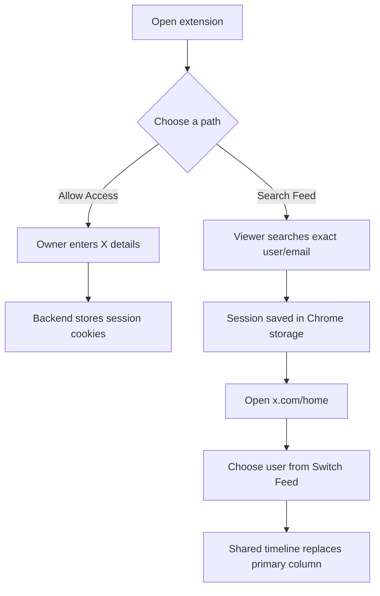
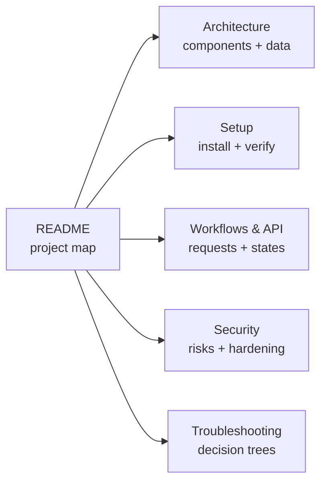
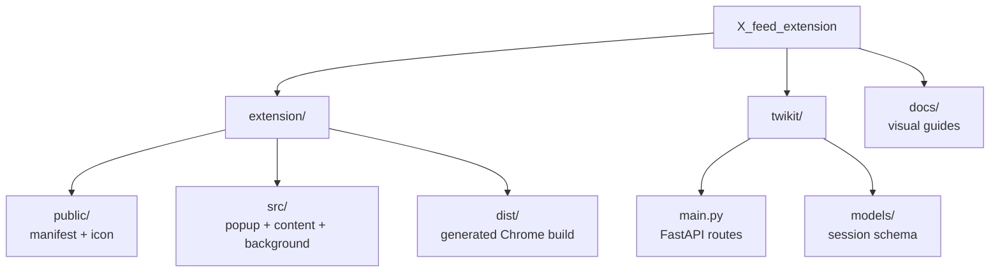
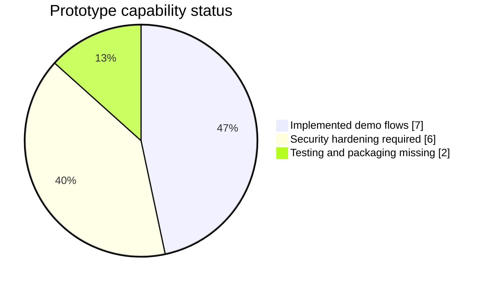
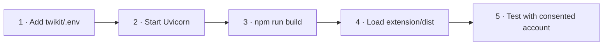
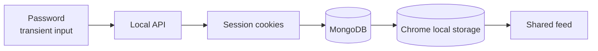
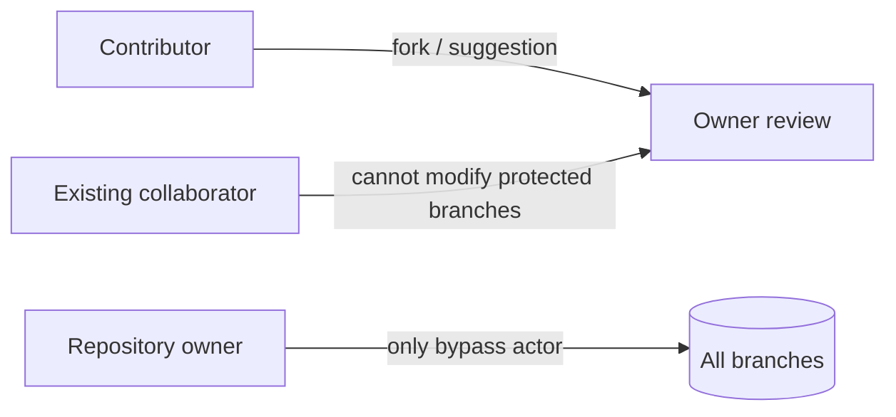

# X Feed Extension

> A consent-based Chrome extension prototype for viewing a shared X home feed.

[Demo video](https://drive.google.com/file/d/1kaC_B0NBTRkO7f37G3d7zcF8YydUI07B/view?usp=sharing) · [Setup](docs/setup.md) · [Architecture](docs/architecture.md) · [Security](docs/security-and-privacy.md)



> [!CAUTION]
> This is a local research prototype. It handles X credentials and reusable session cookies, has no API authentication, and is **not safe for public deployment**. Use test accounts or explicit informed consent only.

## The experience



## What is here

| Browser extension | Local backend | Feed output |
| --- | --- | --- |
| Manifest V3 popup | FastAPI endpoints | Text and timestamps |
| Allow-access screen | Twikit X client | Images and MP4 video |
| Shared-user search | MongoDB sessions | Likes, reposts, replies |
| X page content script | Cookie normalization | Batches of 10, up to 30 |
| Chrome local storage | Expired-session cleanup | Original-feed restore |

## Documentation map



| Guide | Best place to answer |
| --- | --- |
| [Architecture](docs/architecture.md) | What talks to what? Where is data stored? |
| [Setup](docs/setup.md) | How do I run and verify it locally? |
| [Workflows and API](docs/workflows-and-api.md) | What happens in each user journey and endpoint? |
| [Security and privacy](docs/security-and-privacy.md) | What is sensitive, unsafe, or required before production? |
| [Troubleshooting](docs/troubleshooting.md) | Why is a particular step failing? |

## Repository shape



## Stack at a glance

| Layer | Technology | Role |
| --- | --- | --- |
| Extension | Manifest V3, HTML, CSS, JavaScript | Popup and X page integration |
| Bundling | Webpack 5 + Babel | Produces `extension/dist` |
| API | Python, FastAPI, Uvicorn | Session and feed orchestration |
| X client | Twikit | Login and home timeline retrieval |
| Server data | MongoDB + Motor | Shared-session persistence |
| Browser data | `chrome.storage.local` | Viewer-selected sessions |

## Implementation snapshot



| ✅ Implemented | ⚠️ Prototype limitation |
| --- | --- |
| Popup navigation | No backend authentication |
| Twikit session creation | Cookies returned by search API |
| Exact username/email lookup | Cookies stored without app-level encryption |
| Shared-feed selector | Broad `<all_urls>` host permission |
| Text, image, video rendering | Hardcoded `localhost:8000` API |
| Expired local-session removal | No automated test suite |
| Webpack extension build | X DOM/API changes can break integration |

## Run locally



```dotenv
# twikit/.env
MONGODB_URI=mongodb://127.0.0.1:27017
```

```bash
# Terminal 1
cd twikit
python -m venv .venv
source .venv/bin/activate
pip install -r requirements.txt
uvicorn main:app --reload

# Terminal 2
cd extension
npm install
npm run build
```

Then load `extension/dist` from `chrome://extensions` → **Developer mode** → **Load unpacked**. See the [visual setup checklist](docs/setup.md) before entering any account details.

## Data sensitivity



Passwords and cookies must never appear in commits, issues, screenshots, or logs. Follow the [cleanup and revocation flow](docs/security-and-privacy.md#revocation-map) after every demonstration.

## Contributors and control

| Person/account | Relationship |
| --- | --- |
| **Sidheshwar Sarangal** (`SidheshwarSarangal`) | Project owner and maintainer |
| **Ayan** (`AyanMhd`; `maniac` in Git author metadata) | Contributor |
| `GDSC-IITR` | Existing repository collaborator |

The Git history remains the authoritative contribution record. An active **Owner-only branch changes** ruleset preserves collaborator status while allowing only `SidheshwarSarangal` to create, update, or delete repository branches.



## Status

**Core demonstration:** present · **Local research use:** possible · **Production use:** not ready

This project is not affiliated with or endorsed by X Corp.
