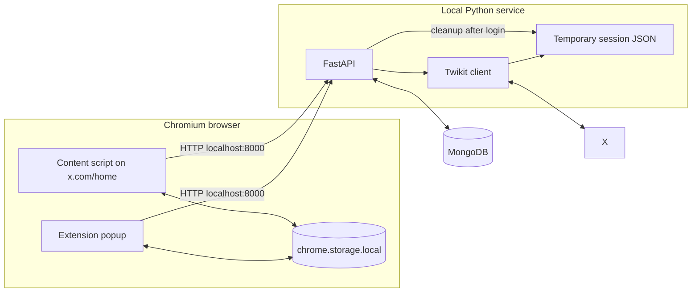
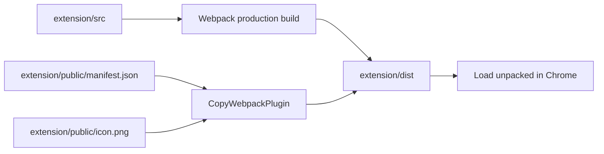
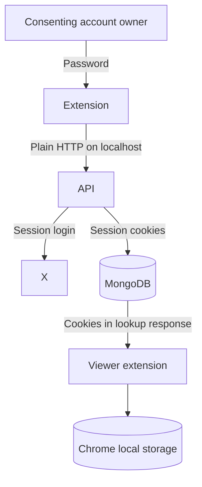

# Architecture

[← README](../README.md) · [Setup](setup.md) · [Workflows and API](workflows-and-api.md) · [Security](security-and-privacy.md) · [Troubleshooting](troubleshooting.md)

## System overview

The project has two runtime applications and two persistence locations:



The extension is the presentation layer. FastAPI coordinates login, lookup, and feed retrieval. Twikit communicates with X. MongoDB keeps shared session records, while Chrome local storage keeps the sessions selected by one browser profile.

## Extension components

### Manifest

`extension/public/manifest.json` defines a Manifest V3 extension with:

- a popup at `main.html`;
- a module service worker at `background.js`;
- the `storage` permission;
- host permission for all URLs;
- a content script restricted to `https://x.com/home*`.

The current `<all_urls>` host permission is broader than the runtime endpoints require. See [Security and privacy](security-and-privacy.md).

### Popup pages

The popup is a small multi-page application built with plain HTML, CSS, and JavaScript:

| Page | Script | Responsibility |
| --- | --- | --- |
| `main.html` | `main.js` | Choose Search Feed or Allow Access |
| `allow-access.html` | `allow-access.js` | Validate fields and call `/login` |
| `search-feed.html` | `search-feed.js` | Find a session and save it locally |

### Content script

`content.js` runs on X's home route and:

1. Adds a fixed feed selector.
2. Reads `userSessions` from Chrome local storage.
3. Calls `/get-feed` for the chosen entry.
4. Clears X's element matching `[data-testid="primaryColumn"]`.
5. Renders up to 30 normalized timeline items in batches of 10.
6. Reloads the page when **Your Feed** is selected.

This integration depends on X's URL and DOM structure. A future X update can break it without any repository change.

### Background worker

`background.js` logs installation and registers an action click listener that can create a 900×700 popup window. The manifest also declares a default popup, so Chrome normally opens that popup directly.

## Backend components

### FastAPI application

`twikit/main.py` loads `MONGODB_URI`, connects to the `twitter_sessions` database, installs permissive CORS middleware, and declares four POST endpoints.

The main service responsibilities are:

- creating Twikit sessions;
- converting raw cookies into a consistent wrapper;
- persisting sessions in the `sessions` collection;
- finding sessions by exact identifiers;
- retrieving and normalizing timeline data;
- extracting image and highest-bitrate MP4 URLs;
- deleting a database record when retrieval fails with an empty result.

### Models

`twikit/models/session_model.py` defines Pydantic models for cookie values and stored sessions. `main.py` also declares endpoint-specific request models.

### MongoDB document

The effective record shape is:

```json
{
  "auth_info_1": "x_username",
  "auth_info_2": "owner@example.com",
  "cookies": {
    "cookies": [
      { "name": "cookie_name", "value": "sensitive_value" }
    ]
  }
}
```

Cookie fields can also contain domain, path, secure, and HTTP-only metadata depending on their source.

## Build pipeline



Webpack creates separate bundles for the background worker, content script, and three popup pages. It cleans `dist`, generates HTML files, and copies the manifest, icon, and stylesheets.

## Trust boundaries



Every arrow carrying a password or cookie crosses a sensitive trust boundary. The current implementation assumes that the browser, local API, MongoDB deployment, and all users of the API are trusted.

## Known architectural constraints

- API URLs are compiled as `http://localhost:8000`.
- CORS allows every origin.
- API requests are not authenticated or authorized.
- Lookup returns complete cookie data to the caller.
- MongoDB records are not encrypted by application code.
- Chrome local storage is not an encrypted secret store.
- The content script replaces X DOM content and is coupled to one selector.
- There is no automated test suite or schema migration layer.
