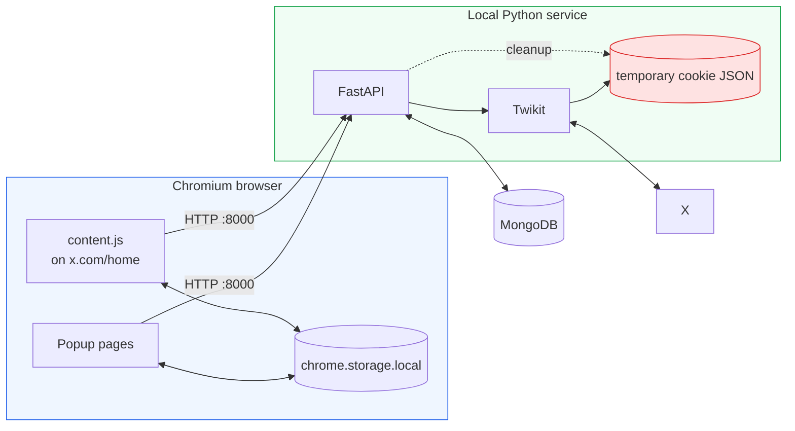
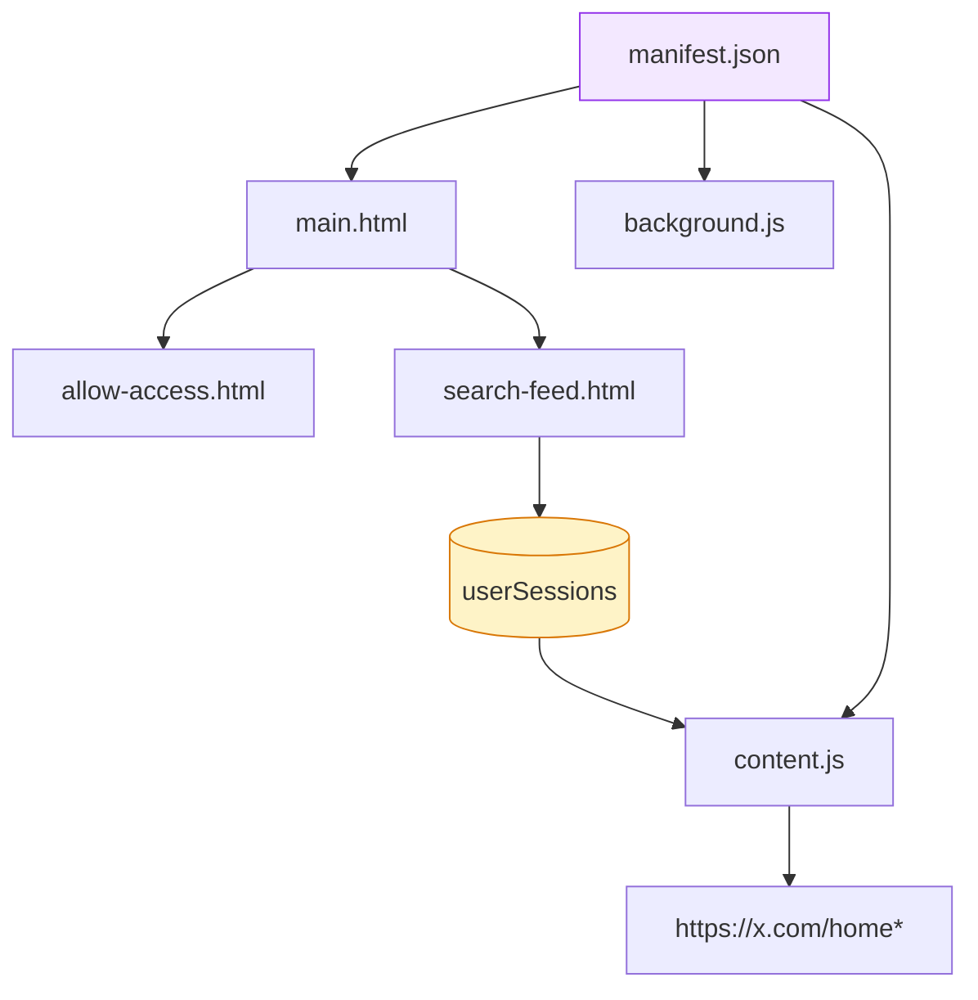
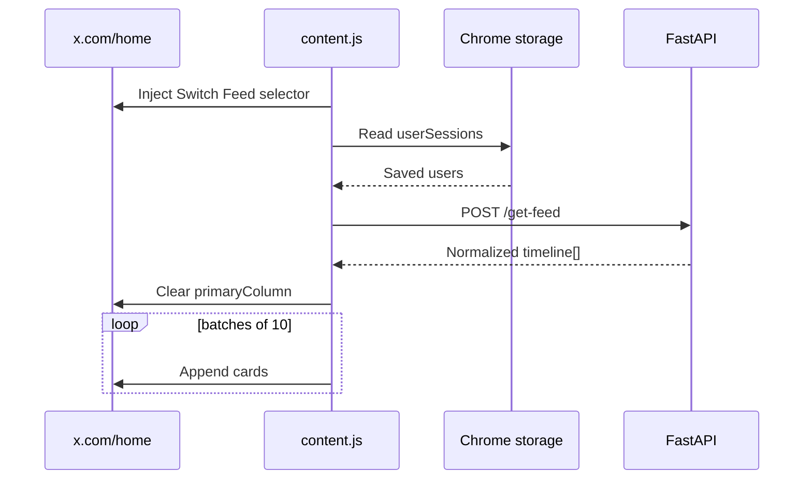
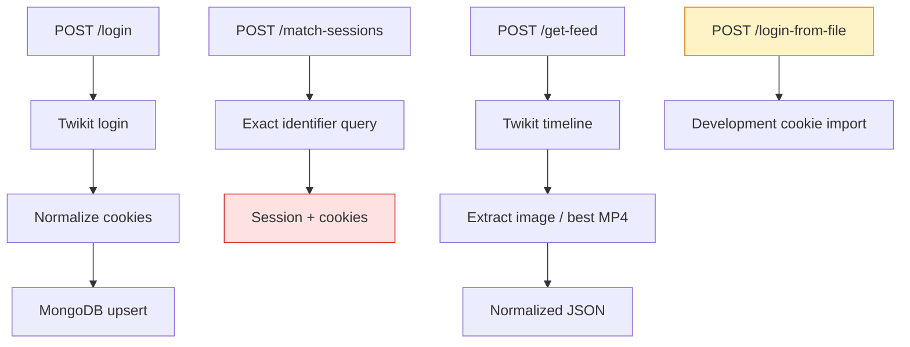
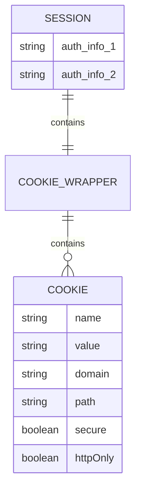
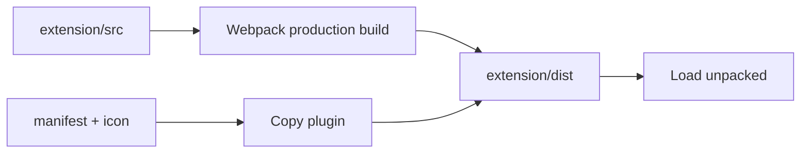

# Architecture

[← README](../README.md) · [Setup](setup.md) · [Workflows](workflows-and-api.md) · [Security](security-and-privacy.md) · [Troubleshooting](troubleshooting.md)

## Runtime map

## Component cards

| Component | Input | Output |
| --- | --- | --- |
| `main.js` | Popup button click | Access or search page |
| `allow-access.js` | Username, email, password | `/login` request |
| `search-feed.js` | Exact identifier | Saved Chrome session |
| `content.js` | Selected session | Injected shared feed |
| `main.py` | API requests | Mongo/Twikit operations |
| `session_model.py` | Cookie fields | Pydantic session model |

## Extension anatomy

### Manifest footprint

| Declaration | Current scope |
| --- | --- |
| Version | Manifest V3 |
| Browser permission | `storage` |
| Host permission | `<all_urls>` ⚠️ |
| Content-script match | `https://x.com/home*` |
| Service worker | ES module |

## Feed replacement path

| Renderer rule | Value |
| --- | --- |
| X selector | `[data-testid="primaryColumn"]` |
| Backend request count | 20 timeline items |
| Renderer ceiling | 30 items |
| Batch size | 10 items |
| Next batch trigger | `IntersectionObserver` |

## Backend map

## Stored shapes

## Build graph

## Coupling and boundaries

| Boundary | Coupling | Break condition |
| --- | --- | --- |
| Extension → API | Hardcoded localhost URL | Port/host changes |
| Content script → X | URL + DOM selector | X UI update |
| Backend → X | Twikit behavior | X/Twikit update |
| Backend → MongoDB | `MONGODB_URI` | Network/auth failure |
| Viewer → session | Raw cookie transfer | Expiry/revocation |

> [!IMPORTANT]
> The red-cookie paths are prototype boundaries, not a production delegation architecture. See [Security](security-and-privacy.md).
