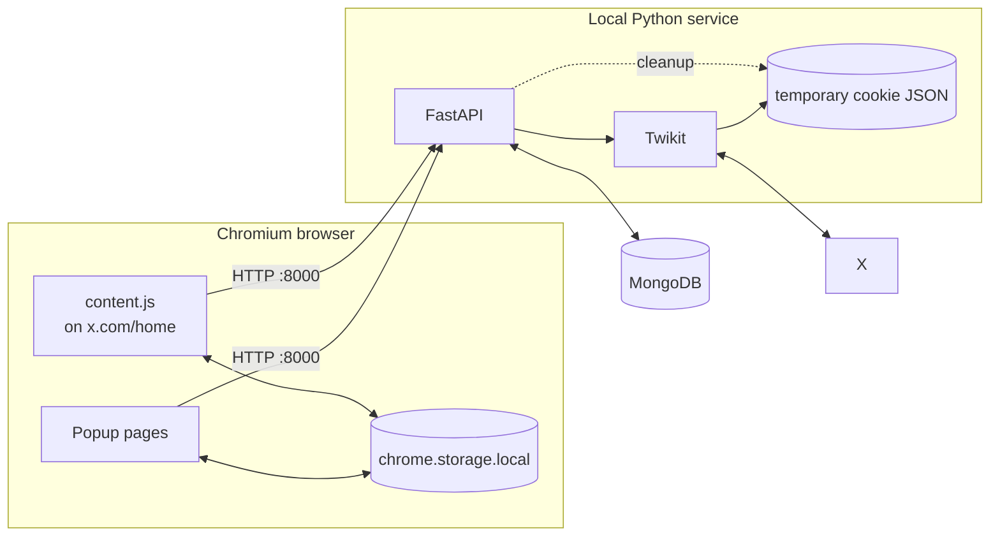
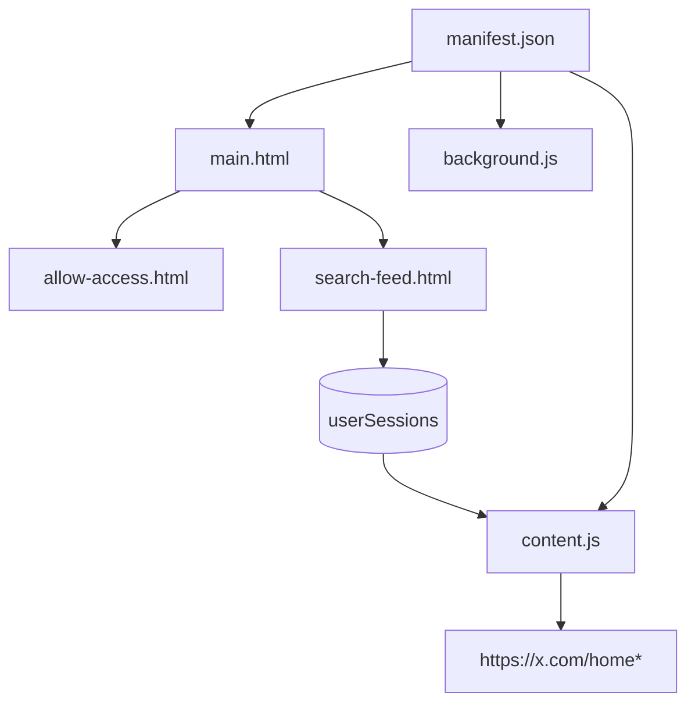
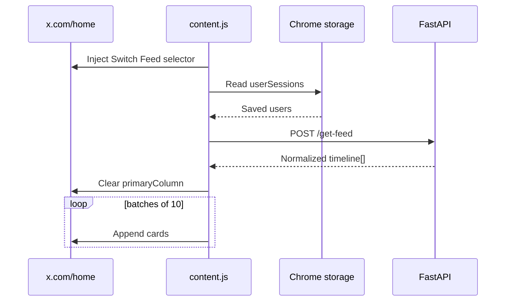
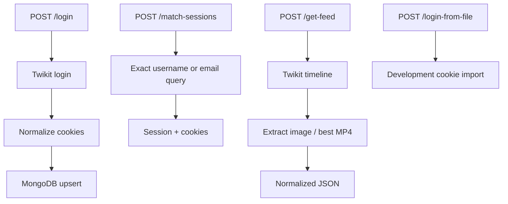
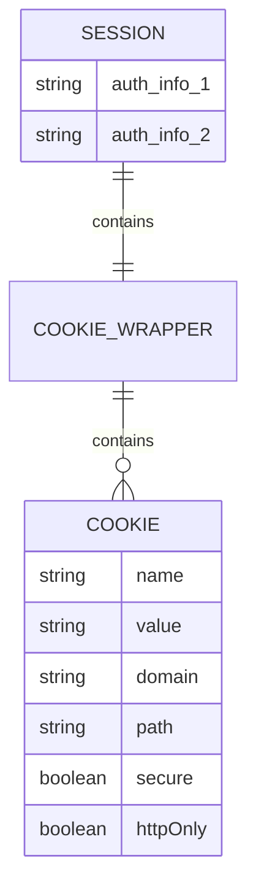
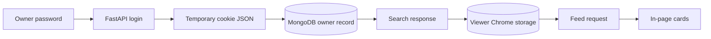
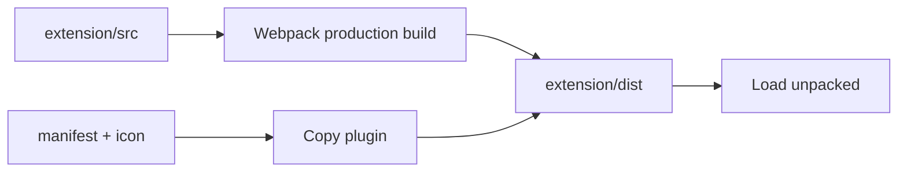

# Architecture

[← README](../README.md) · [User journey](workflows-and-api.md) · [Browser extension](browser-extension.md) · [Backend and API](backend-and-api.md) · [Security](security-and-privacy.md) · [Setup](setup.md) · [Troubleshooting](troubleshooting.md) · [Boundaries](current-boundaries.md)

The architecture has two runtime halves: a Manifest V3 Chrome extension in the viewer’s browser and a local FastAPI service that connects to MongoDB and X through Twikit.

## Runtime map

## Runtime responsibilities

| Layer | Runs where | Owns |
| --- | --- | --- |
| Popup pages | Extension popup | Owner access form and viewer search/save flow |
| Content script | `x.com/home` page context | Switch Feed control, API request, and custom cards |
| Chrome storage | Viewer browser | Saved owner identifiers and flattened cookies |
| Service worker | Extension background context | Installation log and action-click handler |
| FastAPI | Local Python process | Routes, request validation, CORS, and errors |
| Twikit | Inside backend process | X login, cookie application, and timeline request |
| Motor/MongoDB | Backend + database | Async owner-session persistence and lookup |
| X | External platform | Authentication and Home timeline data |

## Component cards

| Component | Input | Output |
| --- | --- | --- |
| `main.js` | Popup button click | Access or search page |
| `allow-access.js` | Username, email, password | `/login` request |
| `search-feed.js` | Exact username or email, then result click | Saved Chrome session |
| `content.js` | Selected session | Injected shared feed |
| `main.py` | API requests | Mongo/Twikit operations |
| `session_model.py` | Cookie fields | Pydantic session model |

The active route handlers also define request models directly in `main.py`; the imported session models are not used as route bodies.

## Extension anatomy

### Manifest footprint

| Declaration | Current scope |
| --- | --- |
| Version | Manifest V3 |
| Browser permission | `storage` |
| Host permission | `<all_urls>` ⚠️ |
| Content-script match | `https://x.com/home*` |
| Service worker | ES module |

## Feed replacement path

The owner list is read from Chrome storage once when `content.js` initializes. If a viewer saves another owner while X Home is open, the page must be refreshed before the new option appears.

| Renderer rule | Value |
| --- | --- |
| X selector | `[data-testid="primaryColumn"]` |
| Backend request count | 20 timeline items |
| Renderer ceiling | 30 items |
| Batch size | 10 items |
| Next batch trigger | `IntersectionObserver` |

## Backend map

## Stored shapes

## Data ownership

| Data | Primary location | Purpose |
| --- | --- | --- |
| Owner password | Login request only | Authenticate through Twikit |
| Temporary cookie JSON | `twikit/sessions` during login | Transfer Twikit output into normalization |
| Owner record | MongoDB `twitter_sessions.sessions` | Make the granted session searchable |
| Saved owner session | Viewer’s `chrome.storage.local` | Populate Switch Feed and call `/get-feed` |
| Normalized timeline | API response and page memory | Render the current shared view |

## Build graph

## Coupling and boundaries

| Boundary | Coupling | Break condition |
| --- | --- | --- |
| Extension → API | Hardcoded localhost URL | Port/host changes |
| Content script → X | URL + DOM selector | X UI update |
| Backend → X | Twikit behavior | X/Twikit update |
| Backend → MongoDB | `MONGODB_URI` | Network/auth failure |
| Viewer → session | Raw cookie transfer | Expiry/revocation |
| Login file → Mongo | Temporary filesystem path | Cleanup or file-format failure |
| Backend cleanup → owner record | First-cookie-value heuristic | Cookie ordering or empty input |

The injected cards omit interaction controls, so the shared view is read-only at the UI layer. This does not make the underlying cookie-sharing design a secure read-only authorization boundary.

> [!IMPORTANT]
> The raw-cookie paths are prototype boundaries, not a production delegation architecture. See [Security](security-and-privacy.md) and [Current boundaries](current-boundaries.md).
