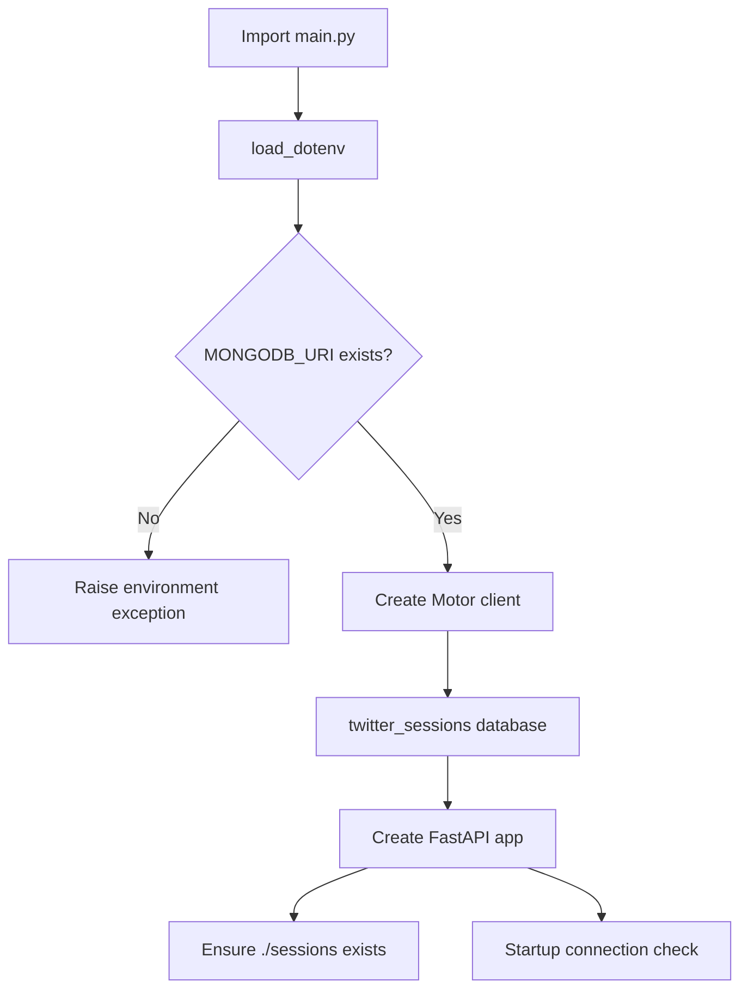
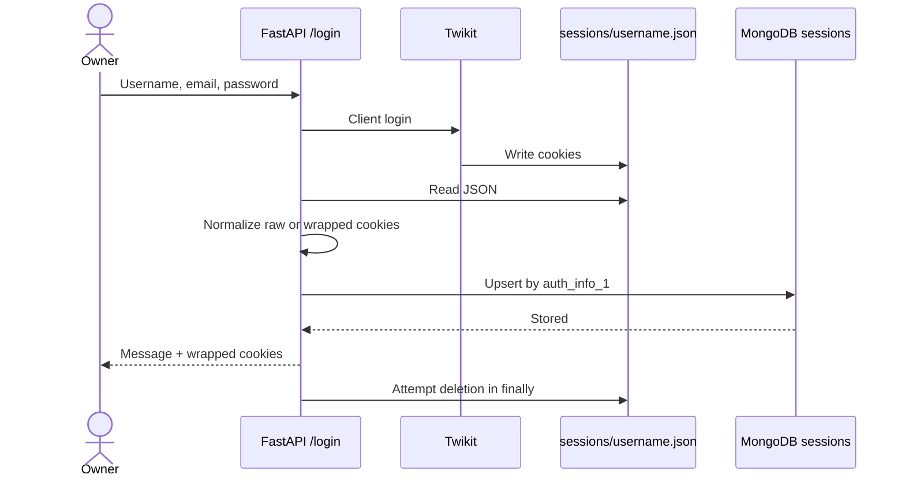
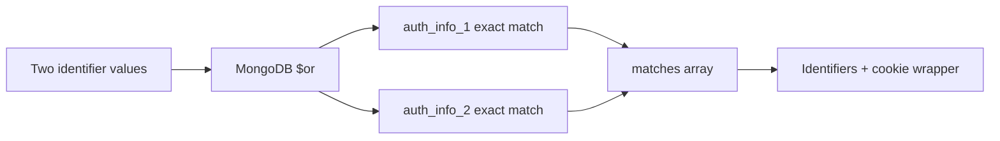
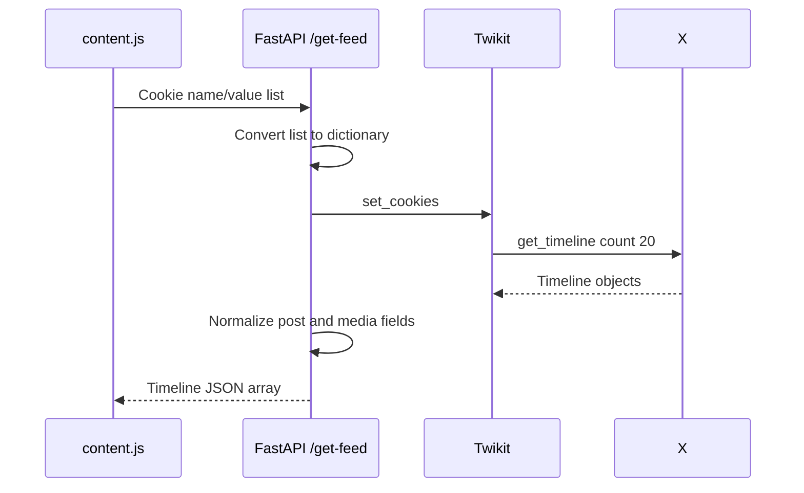
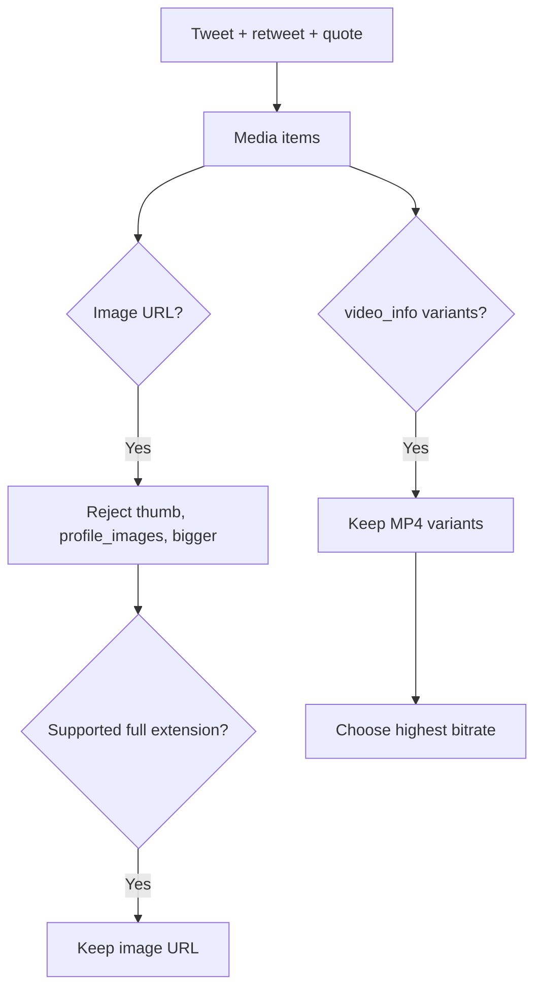
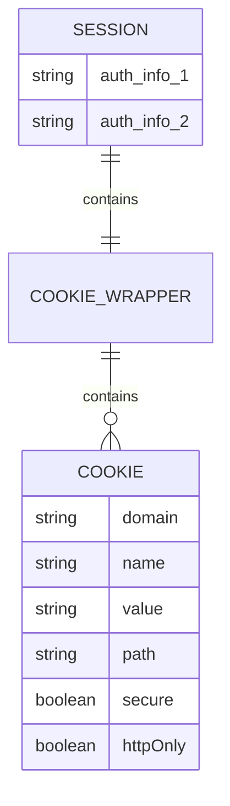

# Backend and API

[← README](../README.md) · [User journey](workflows-and-api.md) · [Browser extension](browser-extension.md) · [Architecture](architecture.md) · [Security](security-and-privacy.md) · [Setup](setup.md) · [Troubleshooting](troubleshooting.md) · [Boundaries](current-boundaries.md)

The local Python service uses FastAPI, Twikit, Motor, and MongoDB. It turns owner credentials into reusable session cookies, makes saved owners searchable, and converts a selected X Home timeline into browser-friendly JSON.

## Responsibilities at a glance

| Component | Responsibility |
| --- | --- |
| FastAPI | Define request models, routes, CORS, and HTTP errors |
| Twikit | Log in to X, set cookies, and request the home timeline |
| Motor | Read, upsert, and delete MongoDB session records asynchronously |
| MongoDB | Persist owner identifiers and wrapped X cookies |
| Temporary JSON | Hold Twikit login cookies long enough to normalize and persist them |
| Media helpers | Filter image URLs and select the highest-bitrate MP4 variant |

## Startup and runtime



The service:

- reads `MONGODB_URI` from `twikit/.env`;
- uses database `twitter_sessions`;
- creates `./sessions` relative to the backend working directory;
- allows all CORS origins, methods, and headers; and
- logs MongoDB startup success or failure.

The startup event logs a failed database check but does not deliberately stop Uvicorn.

## API summary

| Endpoint | Called by | Input | Output |
| --- | --- | --- | --- |
| `POST /login` | Allow Access popup | Username, email, password | Message and cookie wrapper |
| `POST /match-sessions` | Search Feed popup | Username/email search values | Matching records including cookies |
| `POST /get-feed` | X Home content script | Cookie name/value list | Normalized timeline array |
| `POST /login-from-file/{username}` | Not called by extension UI | Backend-relative file path | Imported cookie wrapper |

All endpoints are unauthenticated in the current implementation.

## 1 · `POST /login`

### Request

```json
{
  "auth_info_1": "x_username",
  "auth_info_2": "owner@example.com",
  "password": "account-password"
}
```

### Processing



The cookie path is:

```text
./sessions/{auth_info_1}.json
```

### Cookie normalization

Twikit output can be handled in two shapes.

Raw dictionary:

```json
{
  "cookie_name": "cookie_value"
}
```

The backend converts each item into:

```json
{
  "domain": ".twitter.com",
  "name": "cookie_name",
  "value": "cookie_value",
  "path": "/",
  "secure": false,
  "httpOnly": false
}
```

Already wrapped input:

```json
{
  "cookies": [
    {
      "name": "cookie_name",
      "value": "cookie_value"
    }
  ]
}
```

Both become:

```json
{
  "cookies": [
    {
      "name": "cookie_name",
      "value": "cookie_value"
    }
  ]
}
```

### MongoDB upsert

```text
twitter_sessions.sessions
└── owner record
    ├── auth_info_1: username
    ├── auth_info_2: email
    └── cookies
        └── cookies[]
```

`auth_info_1` is the upsert key. Granting access again for the same username replaces the stored email and cookies.

### Failure and cleanup

Any exception is presented as HTTP `401` with the exception text inside `detail`, even when the underlying problem is a file, MongoDB, X challenge, or server issue. The `finally` block attempts to delete the temporary cookie file whether processing succeeds or fails.

The password is sent to Twikit but is not included in the MongoDB update.

## 2 · `POST /match-sessions`

### Request

```json
{
  "auth_info_1": "exact-search-value",
  "auth_info_2": "exact-search-value"
}
```

### Processing



The extension sends the same string for both fields. MongoDB performs exact stored-value matching; there is no partial matching, normalization, pagination, limit, or caller authorization.

### Response

```json
{
  "matches": [
    {
      "auth_info_1": "x_username",
      "auth_info_2": "owner@example.com",
      "cookies": {
        "cookies": [
          {
            "name": "cookie_name",
            "value": "sensitive-value"
          }
        ]
      }
    }
  ]
}
```

Returning cookies makes the owner session usable by the viewer extension, but it is also the design’s most sensitive boundary.

## 3 · `POST /get-feed`

### Request

```json
{
  "cookies": [
    {
      "name": "cookie_name",
      "value": "sensitive-value"
    }
  ]
}
```

The request model accepts only cookie `name` and `value`.

### Processing



### Timeline normalization

Each result contains:

```json
{
  "author": "Display name",
  "handle": "username",
  "text": "Post text",
  "created_at": "timestamp",
  "likes": 10,
  "retweets": 2,
  "replies": 1,
  "media": ["https://media.example/image.jpg"]
}
```

| Output field | Twikit source |
| --- | --- |
| `author` | `tweet.user.name` |
| `handle` | `tweet.user.screen_name` |
| `text` | `tweet.text` |
| `created_at` | String form of `tweet.created_at` |
| `likes` | `tweet.favorite_count` |
| `retweets` | `tweet.retweet_count` |
| `replies` | `tweet.reply_count` |
| `media` | Extracted from tweet, retweeted status, and quoted status |

### Media extraction

The backend checks the original tweet plus available retweeted and quoted statuses.



Recognized full-media endings include JPG, JPEG, PNG, GIF, WebP, MP4, MOV, and M4V. The browser renderer directly displays common image endings and MP4 video.

### Failure-side deletion attempt

If timeline processing raises an exception before any result is appended, the backend:

1. uses the first submitted cookie value in a MongoDB query;
2. looks for a record whose first stored cookie has that value;
3. deletes the matching session if found; and
4. raises HTTP `500`.

This is a best-effort heuristic. It depends on a non-empty request and on the relevant cookie being first in both arrays.

## 4 · `POST /login-from-file/{username}`

This development endpoint is not called by the extension UI.

It derives a file path as:

```text
./{username}
```

It reads raw or wrapped cookies, normalizes them, and upserts a MongoDB session with:

```text
auth_info_1 = path parameter
auth_info_2 = empty string
```

The path parameter is used directly in backend file-path construction. This endpoint should not be exposed in a production service.

## Data models

### Stored session model



MongoDB records are written directly as dictionaries; there is no database-level schema or unique index declared in this repository.

### Pydantic usage

| Model | Used for |
| --- | --- |
| `LoginRequest` | `/login` JSON body |
| `AuthMatchRequest` | `/match-sessions` JSON body |
| Local `CookieItem` + `CookieList` in `main.py` | `/get-feed` name/value body |
| `CookieItem`, `CookieWrapper`, `SessionModel` in `models/session_model.py` | Imported model definitions; not used as route bodies in the active handlers |
| `models.py` cookie model | Separate unused model definition |

## Current backend boundaries

- Every route is unauthenticated.
- CORS allows all origins, methods, and headers.
- Search returns reusable raw cookie material.
- Error details can include underlying exception text.
- `/login` maps all exceptions to HTTP `401`.
- `/login-from-file/{username}` is a development-only file-reading surface.
- Feed-failure deletion identifies a record through the first cookie value.
- Debug output includes placeholder strings and timeline-related logs.
- There is no rate limiting, encryption layer, audit log, session-expiry job, test suite, or formal API version.

Read [Security and privacy](security-and-privacy.md) for risk handling and [Current boundaries](current-boundaries.md) for the consolidated implementation limits.
