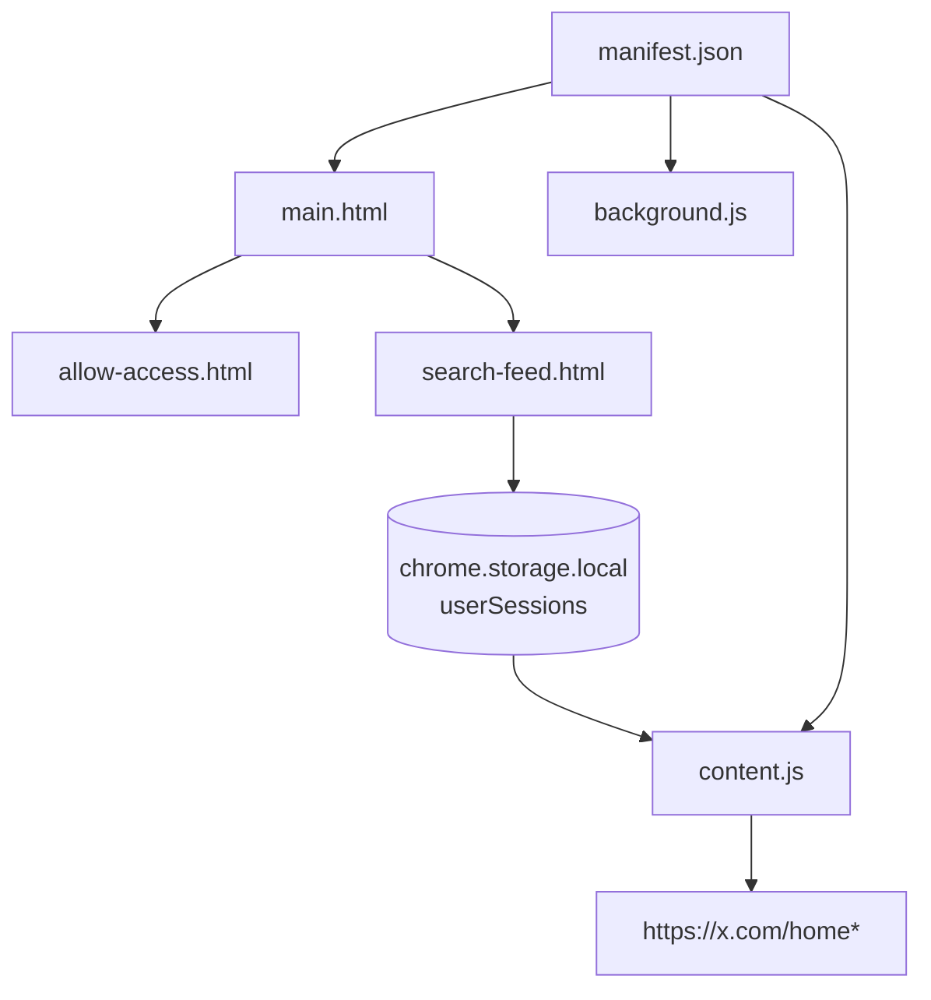
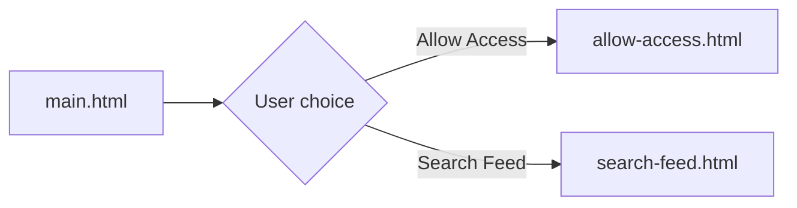
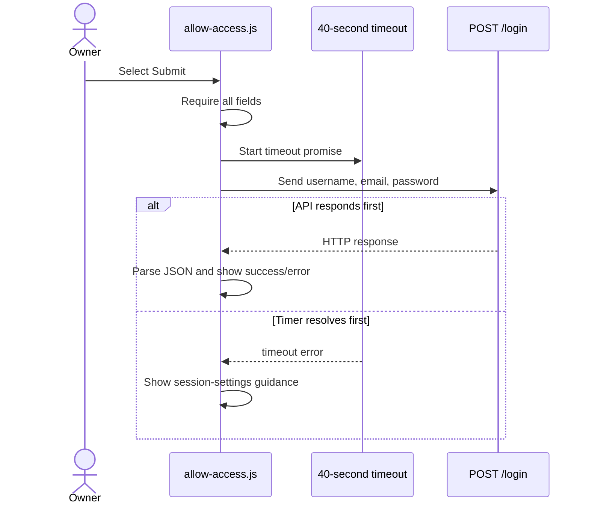
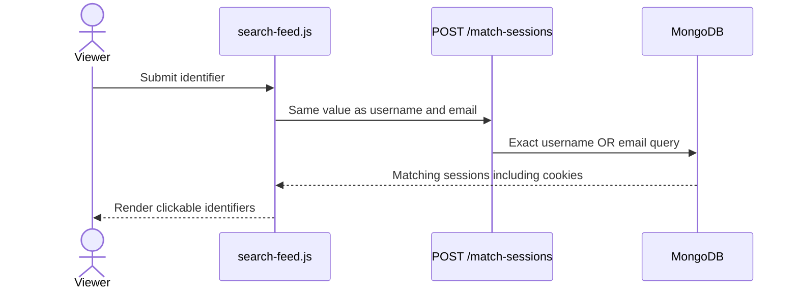
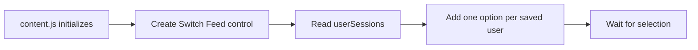
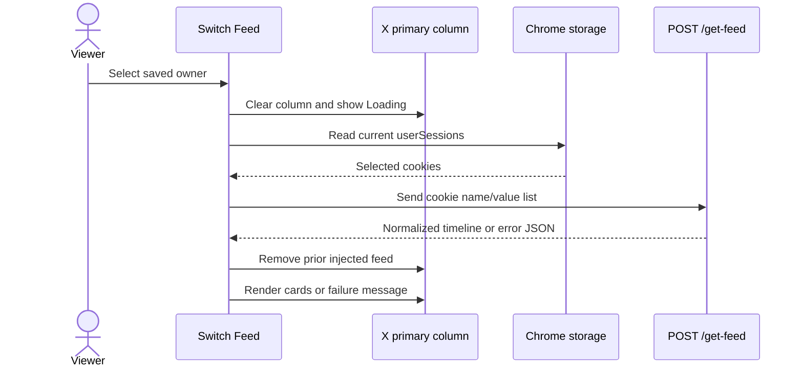
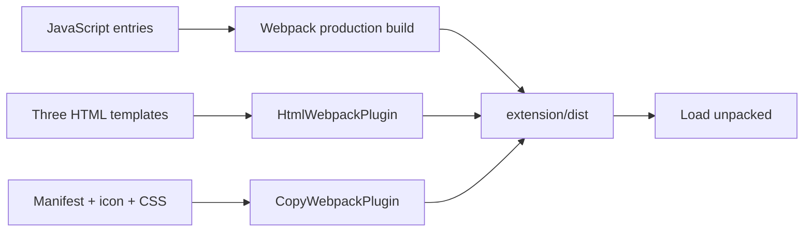

# Browser extension

[← README](../README.md) · [User journey](workflows-and-api.md) · [Backend and API](backend-and-api.md) · [Architecture](architecture.md) · [Security](security-and-privacy.md) · [Setup](setup.md) · [Troubleshooting](troubleshooting.md) · [Boundaries](current-boundaries.md)

The Chrome extension provides three browser surfaces: popup pages for granting and finding access, Chrome storage for saved owner sessions, and a content script that replaces the viewer’s X Home timeline with custom read-only cards.

## Responsibilities at a glance

| Extension part | Responsibility |
| --- | --- |
| `main.html` + `main.js` | Present **Search Feed** and **Allow Access** choices |
| `allow-access.html` + `.js` | Validate owner credentials and call `POST /login` |
| `search-feed.html` + `.js` | Search exact owner identifiers and save a clicked result |
| `content.js` | Add Switch Feed, fetch a selected timeline, and render cards |
| `chrome.storage.local` | Persist the viewer’s selected owner sessions |
| `background.js` | Log installation and define an action-click window handler |
| `manifest.json` | Declare popup, content script, worker, permissions, and resources |

## Manifest footprint

| Declaration | Current value | Effect |
| --- | --- | --- |
| Manifest version | 3 | Uses a service worker rather than a persistent background page |
| Action popup | `main.html` | Toolbar selection opens the main popup |
| Browser permission | `storage` | Allows `chrome.storage.local` access |
| Host permission | `<all_urls>` | Grants broader host access than the current feature needs |
| Content-script match | `https://x.com/home*` | Loads `content.js` on matching X Home URLs |
| Content-script timing | `document_idle` | Runs after the document is mostly loaded |
| Service worker | `background.js`, ES module | Handles install and action events |
| Web-accessible resources | Three CSS files on `<all_urls>` | Makes copied styles broadly accessible |

> [!NOTE]
> Because the manifest defines `default_popup`, Chrome normally opens that popup for the toolbar action. The `chrome.action.onClicked` listener that creates a separate 900×700 window is therefore not the normal click path.

## Extension anatomy



## 1 · Main popup navigation

When the toolbar popup opens, `main.js` attaches click listeners:



The navigation replaces the popup page by assigning `window.location.href`.

## 2 · Allow Access form

### Visible behavior

The owner enters:

- X username;
- X account email; and
- X account password.

All three are required. The form is hidden and a loading state appears while the login request runs.

### Browser processing



The request uses:

```text
POST http://localhost:8000/login
Content-Type: application/json
```

Several backend, network, X, or parsing failures are displayed as a generic credential error. The timeout does not abort the original `fetch`; it only stops waiting for it in the popup.

## 3 · Search Feed page

### Search

The viewer enters one value. `search-feed.js` sends that same value as both identifier fields:

```json
{
  "auth_info_1": "exact-search-value",
  "auth_info_2": "exact-search-value"
}
```



The search is exact and follows MongoDB string matching. It is not a partial search, suggestion system, or live X user lookup.

### Save

Search results are kept temporarily in the page-level `matchedSessions` array. Clicking a `.result-item`:

1. finds the selected session by its `data-index`;
2. chooses username, falling back to email;
3. flattens `session.cookies.cookies`;
4. reads the existing `userSessions` array;
5. skips a duplicate displayed identifier; and
6. writes the updated array to Chrome storage.

> [!IMPORTANT]
> Searching only displays a match. Clicking the result is what saves it.

## 4 · Chrome storage

```text
chrome.storage.local
└── userSessions[]
    ├── auth_info: displayed username or fallback email
    └── cookies[]
        ├── name
        └── value
```

| Behavior | Current implementation |
| --- | --- |
| Duplicate identity | Exact `auth_info` comparison |
| Persistence | Survives page reloads and browser restarts |
| Menu source | Read once when `content.js` initializes |
| Expired entry | Removed after a non-array or empty feed response |
| Full clearing | Extension data clearing or uninstall |

Reusable cookie values are stored directly in the viewer’s browser. Treat this storage as highly sensitive.

## 5 · X Home injection

The manifest loads `content.js` on `https://x.com/home*`. The script performs an additional runtime check:

```text
location.hostname === "x.com"
location.pathname === "/home"
```

If both match, it creates a fixed top-right control:

```text
┌────────────────────────┐
│ 👤 Switch Feed:        │
│ [Your Feed          ▾] │
│  Your Feed             │
│  shared_user_1         │
│  shared_user_2         │
└────────────────────────┘
```



The script does not listen for later storage changes. If the viewer saves another owner while X Home is already open, the page must be refreshed.

## 6 · Select and fetch a shared feed



The extension targets:

```text
[data-testid="primaryColumn"]
```

This X-owned selector is a coupling point. If X changes its DOM, the dropdown may remain visible while feed replacement fails.

## 7 · Timeline renderer

| Renderer rule | Value |
| --- | --- |
| Backend request count | 20 timeline items |
| Renderer ceiling | 30 items |
| Batch size | 10 items |
| Initial batch | First 10 |
| Later batches | Triggered by `IntersectionObserver` |
| Replacement target | X primary column |

### Card contents

```text
┌─────────────────────────────────────────────┐
│ @handle — created time                      │
│                                             │
│ [image or video, when available]            │
│                                             │
│ Post text                                   │
│ ❤️ likes  |  🔁 reposts  |  💬 replies      │
└─────────────────────────────────────────────┘
```

| Included | Not included |
| --- | --- |
| Author handle and creation time | Like button |
| Post text | Reply field or button |
| Images and MP4 videos | Repost button |
| Like, repost, and reply counts | Follow or message actions |
| Video playback controls | Native X interaction menu |

Images load lazily. Videos start muted, use inline controls, and are limited back to 30% volume when unmuted above that value.

The absence of action controls makes the injected cards read-only at the UI level. It does not create a secure read-only permission at the backend or X-session level.

## 8 · Switch back or handle failure

### Your Feed

Selecting **Your Feed** removes the injected wrapper and reloads the page. Reloading is necessary because the original primary-column DOM was cleared.

### Empty or invalid response

If parsed response data is not an array or is an empty array:

1. the page displays a session-expired message;
2. the selected entry is removed from `userSessions`; and
3. the corresponding dropdown option is removed.

The owner must grant access again before the viewer can save a fresh session.

The storage array is spliced and only the selected `<option>` is removed. Later dropdown options keep their old numeric values, so removing a non-final entry can leave stale option indexes until the page is refreshed.

### Network or parsing failure

The content script shows **Error loading feed** but does not remove the local session in the `catch` path.

## Build pipeline



Webpack builds five JavaScript entries: background, content, main, allow-access, and search-feed. Babel processes project JavaScript, and copied public files complete the unpacked extension directory.

## Important files

```text
extension/
├── public/
│   ├── manifest.json
│   └── icon.png
├── src/
│   ├── main.html / main.js
│   ├── allow-access.html / allow-access.js
│   ├── search-feed.html / search-feed.js
│   ├── content.js
│   ├── background.js
│   └── *.css
├── webpack.config.js
├── package.json
└── dist/                     # generated load-unpacked build
```

## Current browser-extension boundaries

- API URLs are hardcoded as `http://localhost:8000`.
- `<all_urls>` host and resource scopes are broader than the current feature needs.
- Search results and Chrome storage contain reusable X cookies.
- Saved-user updates require refreshing an already-open X Home page.
- Feed replacement depends on X’s `primaryColumn` DOM selector.
- The content script logs returned feed data to the console.
- The popup timeout does not cancel its in-flight login request.
- After a submitted login fails, the hidden access form is not restored automatically.
- Search results are assembled with `innerHTML` from stored identifiers rather than escaped text nodes.
- Removing an expired entry can leave later dropdown option indexes stale until refresh.
- There is no options page, explicit remove-user control, lint script, test suite, watcher, or CI workflow.

See [Security and privacy](security-and-privacy.md) and [Current boundaries](current-boundaries.md) before using anything other than dedicated test data.
