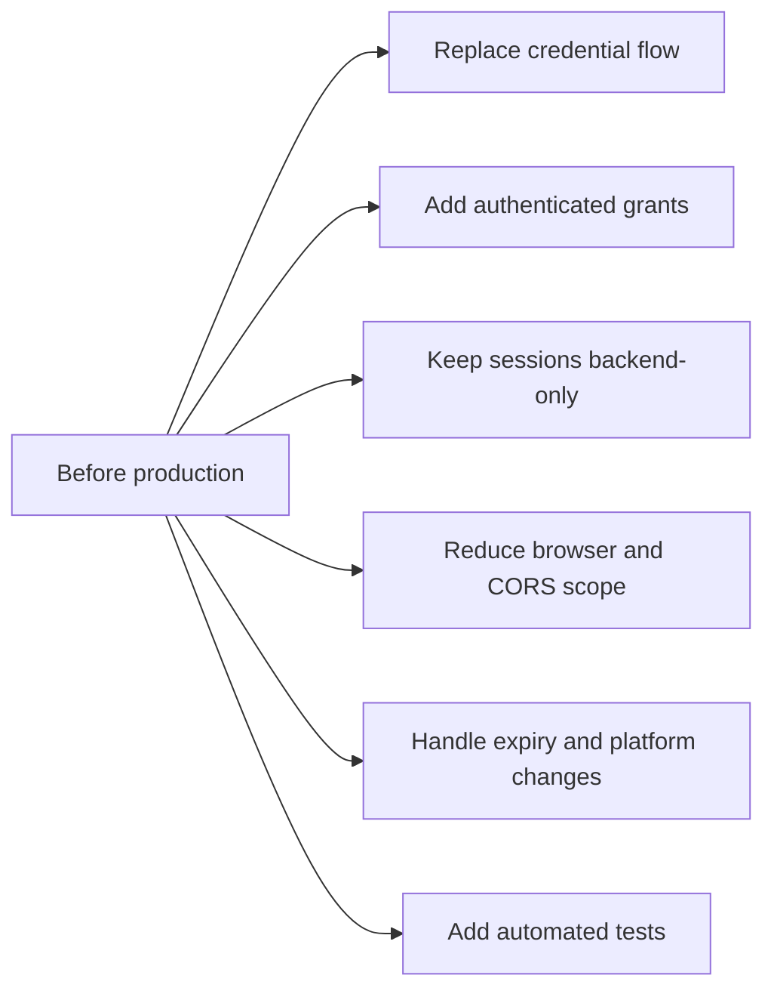
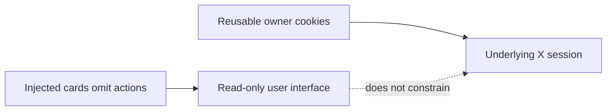

# Current implementation and boundaries

[← README](../README.md) · [User journey](workflows-and-api.md) · [Browser extension](browser-extension.md) · [Backend and API](backend-and-api.md) · [Architecture](architecture.md) · [Security](security-and-privacy.md) · [Setup](setup.md) · [Troubleshooting](troubleshooting.md)

This page records behavior visible in the current source. These are documented observations and correction directions, not completed fixes.

## Before production

## 1 · Browser extension

| Area | Current behavior | Practical effect |
| --- | --- | --- |
| API address | Popup and content scripts call `http://localhost:8000` directly | Host or port changes require source edits and rebuild |
| Manifest host scope | Uses `<all_urls>` | Permission is broader than the active X Home feature |
| Web resources | CSS resources are exposed to `<all_urls>` | Resource scope is broader than necessary |
| Saved sessions | Raw cookie name/value pairs are stored in `chrome.storage.local` | Viewer browser holds reusable X-session material |
| Storage updates | Content script reads `userSessions` only during initialization | Newly saved owners require an X Home refresh |
| Feed target | Replaces `[data-testid="primaryColumn"]` | X DOM changes can break rendering |
| Popup timeout | `Promise.race` stops waiting after 40 seconds | Original login `fetch` is not aborted |
| Access retry | Form is hidden before the login request and not restored after failure | Retrying requires reopening or reloading the popup page |
| Action behavior | Manifest defines a popup and worker also registers `action.onClicked` | Separate popup-window handler is not the normal toolbar path |
| Console output | Content script logs returned feed data | Non-test timeline data can appear in browser logs |
| Result rendering | Search result identifiers are inserted with `innerHTML` | Stored identifier content is not escaped before extension-page rendering |
| Removal UX | No explicit remove-saved-user control | Entries leave storage through expiry handling, clearing data, or uninstall |
| Expired index removal | Selected array item and option are removed without reindexing later options | Remaining dropdown indexes can be stale until refresh |

## 2 · Backend and API

| Area | Current behavior | Practical effect |
| --- | --- | --- |
| API authentication | No endpoint authenticates owner or viewer | Any network caller can attempt every operation |
| Authorization | No owner/viewer grant model exists | Backend cannot determine who is allowed to access which feed |
| CORS | Allows every origin, method, and header | Any browser origin can attempt API requests |
| Login errors | All `/login` exceptions become HTTP `401` | File, database, X, and server failures resemble credential failures |
| Exception exposure | Several `detail` responses include exception strings | Internal information can reach callers |
| Search result | Returns identifiers and full cookie wrapper | Search doubles as session-material retrieval |
| File import | `/login-from-file/{username}` reads a path derived from the URL | Unsafe development surface if exposed |
| Feed cleanup | Failure deletion matches the first submitted cookie value | Cleanup is heuristic and order-dependent |
| Startup check | MongoDB failure is logged | Uvicorn can remain running without a healthy database |
| API lifecycle | No version, rate limit, audit log, or revocation endpoint | Operation and compatibility controls are absent |

## 3 · Session and data lifecycle

| Area | Current behavior | Practical effect |
| --- | --- | --- |
| Owner password | Sent to local API and Twikit during login | Highly sensitive transient input |
| Temporary login file | Twikit writes `sessions/{username}.json`; backend attempts deletion in `finally` | Cleanup is best-effort rather than guaranteed externally |
| MongoDB session | Username, email, and wrapped cookies persist | Account-access material remains until failure or manual deletion |
| Viewer storage | Selected identifier and flattened cookies persist in Chrome | Session remains across browser restarts |
| Automatic expiry | No backend TTL or scheduled validity check | Invalid sessions are discovered only when used |
| Failure removal | Viewer entry is removed on non-array or empty parsed response | Network/parse `catch` retains the entry |
| MongoDB deletion | `/get-feed` may delete a record after an early failure | One viewer request can remove the shared owner record |
| Revocation | No extension/API revocation workflow | Effective revocation requires X, MongoDB, and Chrome cleanup |

## 4 · Feed behavior

| Area | Current behavior | Practical effect |
| --- | --- | --- |
| Timeline request | Twikit requests 20 X Home items | Shared view is a limited snapshot |
| Renderer ceiling | Browser renderer supports up to 30 | Current backend normally supplies fewer than the ceiling |
| Pagination | Cards append in batches of 10 through `IntersectionObserver` | Scrolling is client-side over one fetched array |
| Interactions | Injected cards omit like, reply, repost, follow, and message actions | View is read-only only at the UI layer |
| Media | Backend filters URLs and selects best MP4 bitrate | Unsupported or changed media shapes may be omitted |
| X dependency | Uses Twikit and X-owned DOM/data shapes | X or Twikit updates can break login, fetch, extraction, or injection |
| Native restoration | Selecting Your Feed reloads the page | Reload is required because native timeline DOM was cleared |

## 5 · Build, configuration, and quality

| Area | Current behavior | Practical effect |
| --- | --- | --- |
| Requirements encoding | `twikit/requirements.txt` is UTF-16 | Some pip environments report decoding errors |
| MongoDB configuration | Only `MONGODB_URI` is environment-driven | API URL, database/collection names, counts, and scopes are hardcoded |
| Build | Webpack production build outputs `extension/dist` | Source changes require build and Chrome reload |
| Tests | No automated backend or extension tests | Login, storage, API, rendering, and security regressions are manual |
| Lint/format | No lint script is defined | Code-quality checks are not repeatable |
| Watch/CI | No watcher or CI workflow | Build and verification are manual |
| Logging | Debug messages and placeholder strings remain | Logs are noisy and may include sensitive context |

## 6 · Security meaning of “read-only”

The shared cards do not provide like, reply, repost, follow, or message controls. This is a presentation property, not a scoped authorization guarantee. The transferred session cookies may represent broader account capabilities outside the injected view.

## Production correction order

1. Replace password collection and Twikit login with official scoped authorization where available.
2. Keep session credentials on the backend and return opaque, short-lived grants instead of cookies.
3. Authenticate owners and viewers; authorize every search and feed request.
4. Add explicit consent, duration, revocation, and audit records.
5. Encrypt managed secrets, rotate keys, define retention, and remove sensitive console output.
6. Reduce CORS, host permissions, and web-accessible resources to exact required scopes.
7. Remove or strictly isolate the file-import endpoint.
8. Add expiry checks, reliable cleanup, rate limits, structured errors, and health endpoints.
9. Add unit, integration, browser, security, and X-change regression tests.
10. Review X platform rules, privacy obligations, and the complete threat model.

## Related guides

| Boundary area | Detailed guide |
| --- | --- |
| Popup, storage, content script, and rendering | [Browser extension](browser-extension.md) |
| FastAPI, Twikit, MongoDB, endpoints, and media | [Backend and API](backend-and-api.md) |
| Credential, cookie, consent, and revocation risk | [Security and privacy](security-and-privacy.md) |
| Failure isolation | [Troubleshooting](troubleshooting.md) |

---

This project is not affiliated with or endorsed by X Corp.
