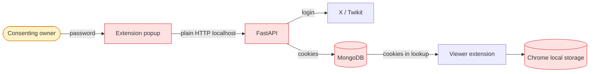
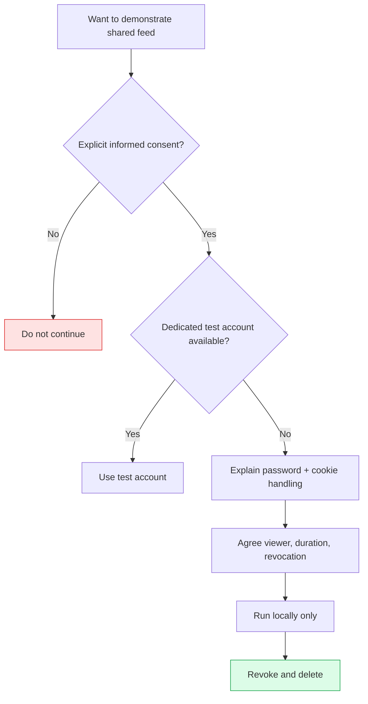
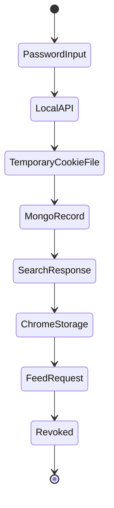
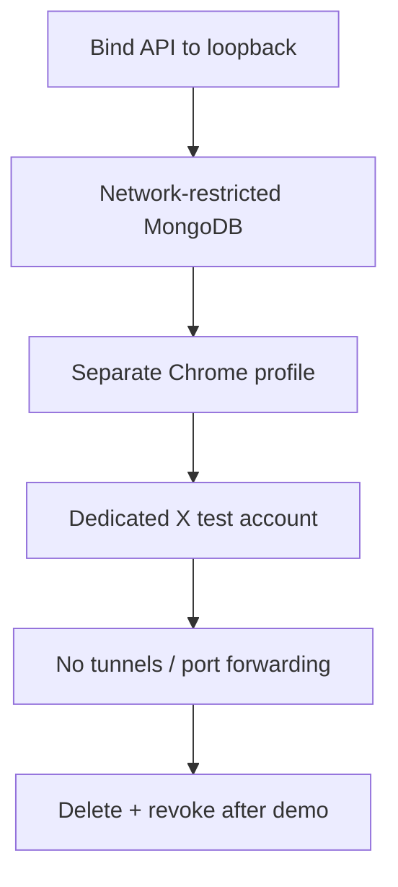
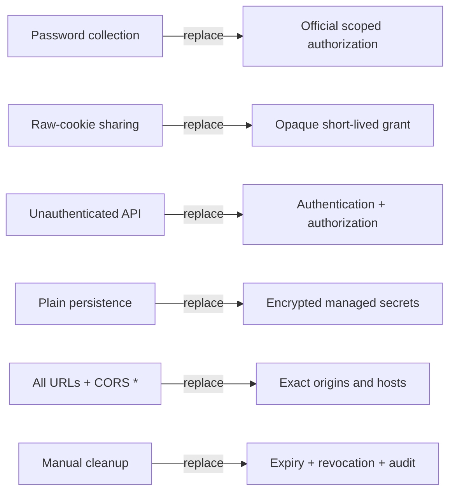
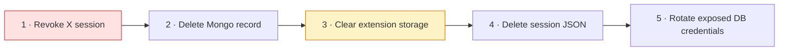
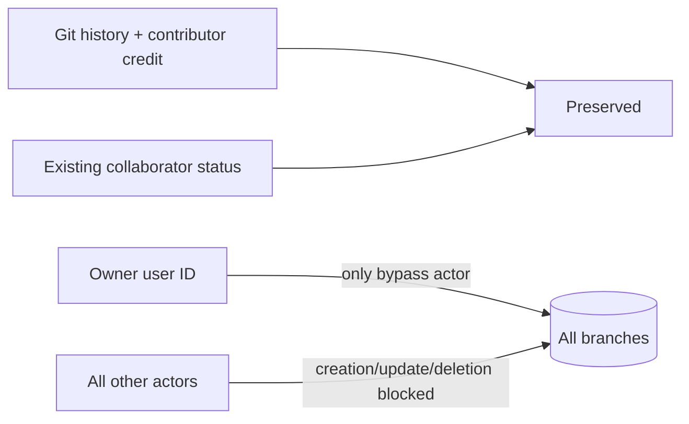

# Security and privacy

[← README](../README.md) · [Architecture](architecture.md) · [Setup](setup.md) · [Workflows](workflows-and-api.md) · [Troubleshooting](troubleshooting.md)

> [!WARNING]
> Local research prototype only. Do not expose this backend publicly.

## Trust map



## Consent gate



Consent to view never grants permission to post, message, follow, or modify the account.

## Risk board

| Severity | Current condition | Why it matters |
| --- | --- | --- |
| 🔴 Critical | Lookup returns raw cookies | Callers receive reusable sessions |
| 🔴 Critical | API has no authentication | No caller identity or authorization |
| 🔴 Critical | Cookies stored in MongoDB/Chrome | Persistent account-access material |
| 🟠 High | Password entered in extension | Highly sensitive transient input |
| 🟠 High | CORS allows all origins | Any origin can attempt API calls |
| 🟠 High | Manifest uses `<all_urls>` | Permission scope is too broad |
| 🟠 High | File-import endpoint exists | Unsafe production surface |
| 🟡 Operational | Twikit and X DOM can change | Reliability is not controlled |

## Sensitive-data lifecycle



| Data | Expected lifetime | Current deletion path |
| --- | --- | --- |
| Password | Login request only | Not placed in Mongo update |
| Temporary JSON | During login | `finally` cleanup attempt |
| Mongo cookies | Until failure/manual deletion | Database cleanup |
| Chrome cookies | Until expiry/manual clearing | Storage removal/uninstall |
| X session | Until revoked/expired | X security settings |

## Minimum safe-demo boundary



## Production replacement map



### Hardening order

1. Official scoped authorization; no password collection.
2. Backend-only session custody; never return cookies from search.
3. Authenticated owner/viewer model with revocable grants.
4. Encryption, key rotation, retention, rate limits, and audit events.
5. Exact CORS/manifest scope and removal of file import.
6. Authorization, revocation, and privacy tests.
7. Legal, platform-policy, privacy, and threat-model review.

## Revocation map



Revoking the X session is the key step: it invalidates cookies at their source.

## Never log or publish

```text
passwords ✕ cookie values ✕ MongoDB URIs ✕ private feed content ✕ unredacted email
```

The current content script logs returned feed data in the browser console. Remove or redact that output before using non-test data.

## Repository access model



Attribution and direct branch control are intentionally separate.
