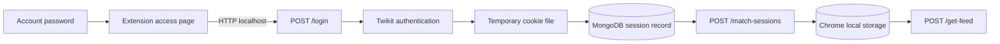

# Security and privacy

[← README](../README.md) · [Architecture](architecture.md) · [Setup](setup.md) · [Workflows and API](workflows-and-api.md) · [Troubleshooting](troubleshooting.md)

## Scope

X Feed Extension is a research prototype that handles account credentials and reusable session cookies. The current implementation is suitable only for controlled local demonstrations with explicit consent. It is not production-safe and must not be presented as a secure delegation system.

## Consent requirements

Before using another person's account or feed:

- obtain explicit, informed, revocable consent;
- explain that the prototype asks for their X password during session creation;
- explain where session cookies are stored;
- define who can view the feed and for how long;
- provide a clear way to end participation and revoke the X session;
- avoid collecting private or sensitive content unrelated to the demonstration.

Consent to view a feed is not consent to post, message, follow, change settings, or take any other account action.

## Sensitive-data lifecycle

The password is used for login and is not included in the database update. Cookies remain sensitive after login because they can represent an authenticated session.

## Current risks

### Critical

- `/match-sessions` returns complete cookies to callers without authentication or authorization.
- `/get-feed`, `/login`, and the file-import route are also unauthenticated.
- CORS permits all origins, methods, and headers.
- Session cookies are stored in MongoDB without application-level encryption.
- Selected cookies are stored in `chrome.storage.local`, which is persistence—not a dedicated secret vault.

### High

- The access page handles the user's real X password.
- The extension requests `<all_urls>` host access even though its intended HTTP service is local.
- Backend errors may expose internal exception details.
- `login-from-file` resolves a caller-provided path segment and should not exist in a public deployment.
- There is no session ownership model, approval token, expiry policy, or revocation endpoint.

### Operational

- Twikit is an unofficial client and can be affected by X changes or account challenges.
- X DOM selectors can change without warning.
- Temporary files are removed on the normal login path, but abnormal process termination can leave data behind.
- Uninstalling the extension does not remove server-side MongoDB records.

## Safe local-demo controls

At minimum:

1. Use a dedicated test account.
2. Bind the API only to loopback; do not use `--host 0.0.0.0`.
3. Use a local or network-restricted MongoDB instance.
4. Do not share API ports through tunnels or port forwarding.
5. Keep Chrome profiles used for testing separate from daily browsing.
6. Delete MongoDB records and Chrome extension storage after the demo.
7. Revoke the X session after testing.
8. Inspect `twikit/sessions` for leftover cookie files.

## Production hardening priorities

The following would be required before considering any broader use:

1. Replace password collection with an official, scoped authorization mechanism.
2. Add authenticated users and explicit per-session authorization.
3. Never return raw cookies from a search endpoint.
4. Keep session tokens exclusively on a trusted backend.
5. Issue opaque, short-lived sharing grants with expiry and revocation.
6. Encrypt sensitive records with managed keys and rotate them.
7. Restrict CORS and extension host permissions to exact origins.
8. Remove or strictly isolate the cookie-file import endpoint.
9. Add rate limits, audit events, secret redaction, and generic public errors.
10. Add retention controls and automatic deletion.
11. Add tests for authorization boundaries and session revocation.
12. Complete a legal, privacy, platform-policy, and threat-model review.

## Revocation and deletion

Ending access requires cleanup in more than one place:

- revoke the relevant login session in X account security settings;
- delete its MongoDB `sessions` record;
- remove `userSessions` from the viewer's extension storage;
- delete any remaining local session JSON files;
- rotate any database credentials exposed during development.

Revoking the X session is the most important step because it invalidates the reusable cookies at their source.

## Logging guidance

Do not add logs containing:

- passwords;
- full cookie objects or cookie values;
- MongoDB connection strings;
- private feed contents;
- email addresses unless strictly necessary and protected.

The existing feed script logs returned API data to the browser console. Remove or redact that behavior before using non-test data.

## Responsible repository access

Contributor credit and repository write access are separate concerns. Keep authorship in Git history and documentation, while limiting direct branch access to trusted maintainers. Other contributors can propose changes through forks or reviews without receiving permission to modify protected branches directly.
