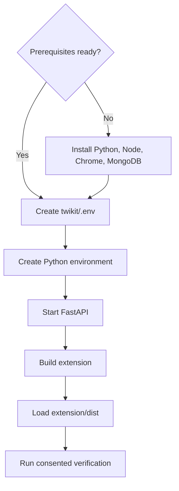
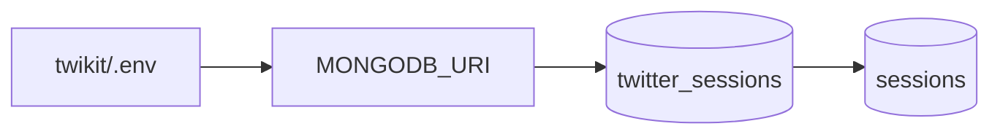
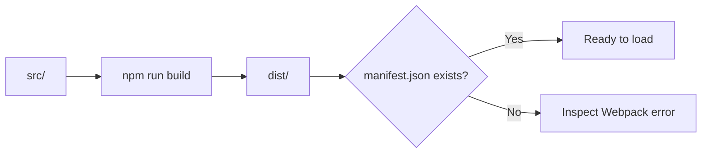
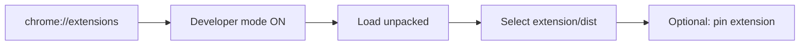
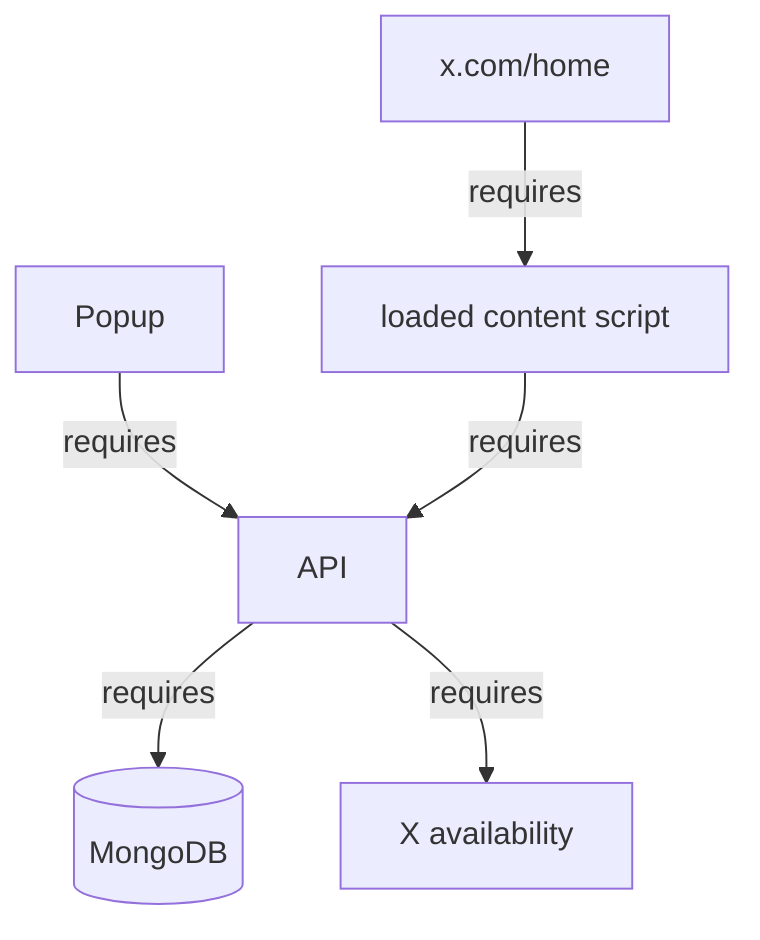
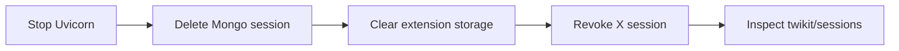

# Setup

[← README](../README.md) · [Architecture](architecture.md) · [Workflows](workflows-and-api.md) · [Security](security-and-privacy.md) · [Troubleshooting](troubleshooting.md)

> [!CAUTION]
> Use a test account or explicit informed consent. Keep port 8000 private and local.

## Installation path



## Prerequisite matrix

| Tool | Needed for | Quick check |
| --- | --- | --- |
| Python 3.10+ | FastAPI/Twikit backend | `python --version` |
| Node.js + npm | Extension build | `node --version` |
| MongoDB | Shared sessions | Connection URI available |
| Chromium browser | Extension runtime | `chrome://extensions` |
| Test X account | Safe verification | Session revocable |

## 1 · Configure data storage



```dotenv
MONGODB_URI=mongodb://127.0.0.1:27017
```

`*.env` is ignored by Git. Never paste the URI into source, screenshots, or issues.

## 2 · Start the backend

```bash
cd twikit
python3 -m venv .venv
source .venv/bin/activate
pip install -r requirements.txt
uvicorn main:app --reload
```

Windows activation:

```powershell
py -m venv .venv
.venv\Scripts\Activate.ps1
```

| Expected signal | Meaning |
| --- | --- |
| API at `127.0.0.1:8000` | Uvicorn is running |
| MongoDB success message | Database is reachable |
| `MONGODB_URI not set` | `.env` missing or wrong working directory |

> [!NOTE]
> `requirements.txt` is UTF-16. If pip reports a decoding error, convert only its encoding to UTF-8 and retry.

## 3 · Build the extension

```bash
cd extension
npm install
npm run build
```



## 4 · Load into Chrome



After a source change:

```text
npm run build → chrome://extensions → Reload → refresh x.com/home
```

## 5 · Verification board

| # | Check | Pass signal |
| ---: | --- | --- |
| 1 | Start API | No environment exception |
| 2 | Check MongoDB | Connection success logged |
| 3 | Open popup | Two journey buttons visible |
| 4 | Submit empty access form | Validation appears |
| 5 | Authorize test account | Access-granted message |
| 6 | Search exact identifier | Test user returned |
| 7 | Select result | Saved-session confirmation |
| 8 | Open `x.com/home` | Switch Feed selector visible |
| 9 | Select test user | Timeline cards rendered |
| 10 | Select Your Feed | X page reloads normally |

## Runtime dependency map



## Cleanup after testing



The extension has no automated tests, lint script, watcher, or CI workflow. A Webpack success confirms bundling—not end-to-end behavior or security.
