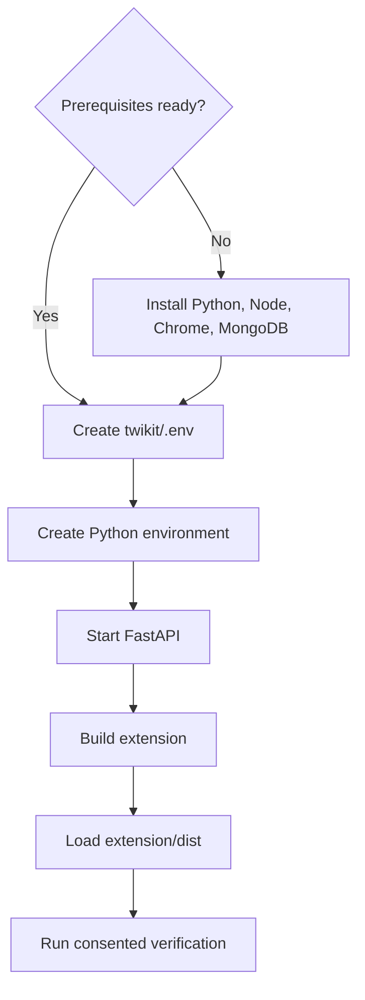
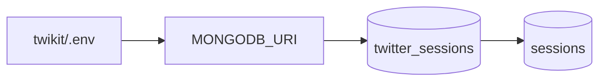
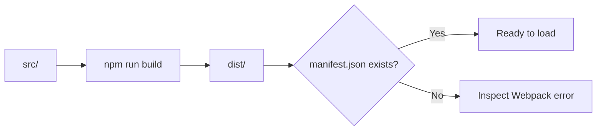
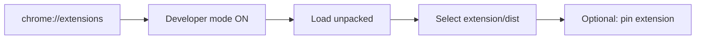
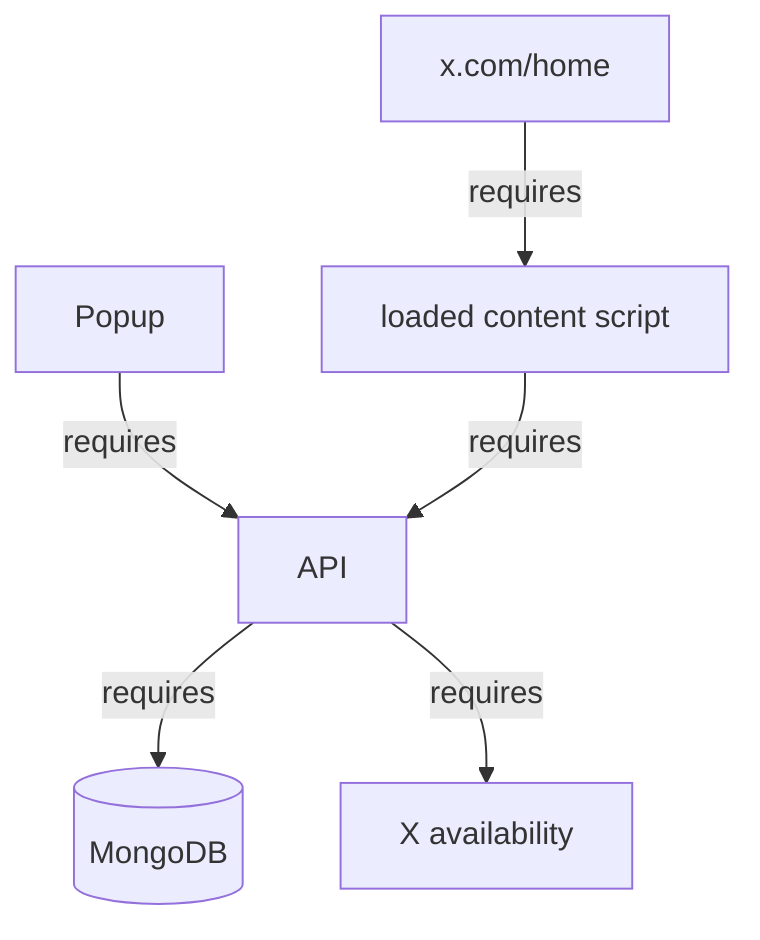
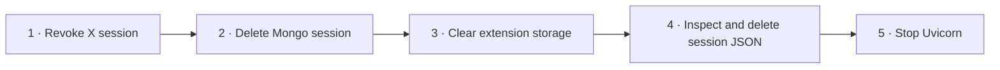

# Local setup and verification

[← README](../README.md) · [User journey](workflows-and-api.md) · [Browser extension](browser-extension.md) · [Backend and API](backend-and-api.md) · [Architecture](architecture.md) · [Security](security-and-privacy.md) · [Troubleshooting](troubleshooting.md) · [Boundaries](current-boundaries.md)

> [!CAUTION]
> Use a test account or explicit informed consent. Keep port 8000 private and local.

## Installation path



## Prerequisite matrix

| Tool | Needed for | Quick check |
| --- | --- | --- |
| Python 3.10+ | FastAPI/Twikit backend | `python --version` |
| Node.js + npm | Extension build | `node --version` |
| MongoDB | Shared sessions | Connection URI available |
| Chromium browser | Extension runtime | `chrome://extensions` |
| Test X account | Safe verification | Session revocable |

## 1 · Configure data storage



```dotenv
MONGODB_URI=mongodb://127.0.0.1:27017
```

`*.env` is ignored by Git. Never paste the URI into source, screenshots, or issues.

| Setting | Current value or source |
| --- | --- |
| Environment file | `twikit/.env` |
| Required variable | `MONGODB_URI` |
| Database name | `twitter_sessions` |
| Collection name | `sessions` |
| Backend URL in extension | Hardcoded `http://localhost:8000` |

Both extension installations in a two-person demonstration must reach the same FastAPI process and MongoDB database.

## 2 · Start the backend

```bash
cd twikit
python3 -m venv .venv
source .venv/bin/activate
pip install -r requirements.txt
uvicorn main:app --reload
```

Windows activation:

```powershell
py -m venv .venv
.venv\Scripts\Activate.ps1
```

| Expected signal | Meaning |
| --- | --- |
| API at `127.0.0.1:8000` | Uvicorn is running |
| MongoDB success message | Database is reachable |
| `MONGODB_URI not set` | `.env` missing or wrong working directory |
| `/docs` opens | FastAPI generated API reference is available |

> [!NOTE]
> `requirements.txt` is UTF-16. If pip reports a decoding error, convert only its encoding to UTF-8 and retry.

The backend creates `twikit/sessions/` at startup relative to the working directory. Run Uvicorn from `twikit/` so `.env` and temporary-session paths resolve as documented.

## 3 · Build the extension

```bash
cd extension
npm install
npm run build
```

The build produces:

```text
extension/dist/
├── manifest.json
├── icon.png
├── main.html / main.js
├── allow-access.html / allow-access.js
├── search-feed.html / search-feed.js
├── content.js
├── background.js
└── copied CSS files
```



## 4 · Load into Chrome



After a source change:

```text
npm run build → chrome://extensions → Reload → refresh x.com/home
```

## 5 · Verify the complete two-person flow

Use two separate Chrome profiles when possible: one to represent the feed owner and one to represent the viewer. Both profiles must use an extension build connected to the same local API and MongoDB database.

| # | Check | Pass signal |
| ---: | --- | --- |
| 1 | Start API | No environment exception |
| 2 | Check MongoDB | Connection success logged |
| 3 | Open popup | Two journey buttons visible |
| 4 | Submit empty access form | Validation appears |
| 5 | As owner, enter username + email + password | Access-granted message |
| 6 | As viewer, search exact username or email | Test user returned |
| 7 | Click the returned user | Saved-session confirmation |
| 8 | Open or refresh `x.com/home` | Switch Feed selector lists the saved user |
| 9 | Select the saved user | Read-only timeline cards replace the main column |
| 10 | Select Your Feed | X page reloads and the normal feed returns |

## Runtime dependency map



## Verification boundaries

| If this step fails | Inspect next |
| --- | --- |
| Backend does not start | Python environment, requirements encoding, and `.env` |
| MongoDB message fails | URI, service, firewall, DNS, or TLS |
| Popup cannot submit | Uvicorn, port 8000, and browser console |
| Search returns nothing | Exact value, owner record, and shared database |
| Saved owner does not appear | Click result, inspect `userSessions`, then refresh X Home |
| Feed does not render | Session validity, backend log, X availability, and DOM selector |

## Cleanup after testing



The extension has no automated tests, lint script, watcher, or CI workflow. A Webpack success confirms bundling—not end-to-end behavior or security.

For detailed failure trees, read [Troubleshooting](troubleshooting.md). For the security meaning of cleanup and revocation, read [Security and privacy](security-and-privacy.md).
