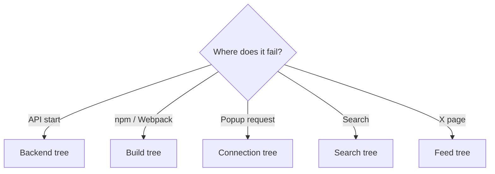
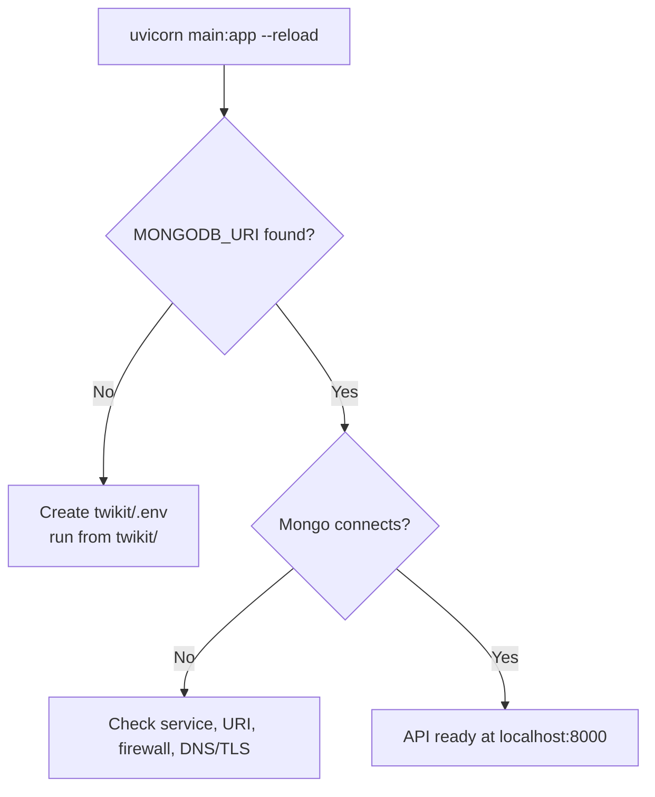
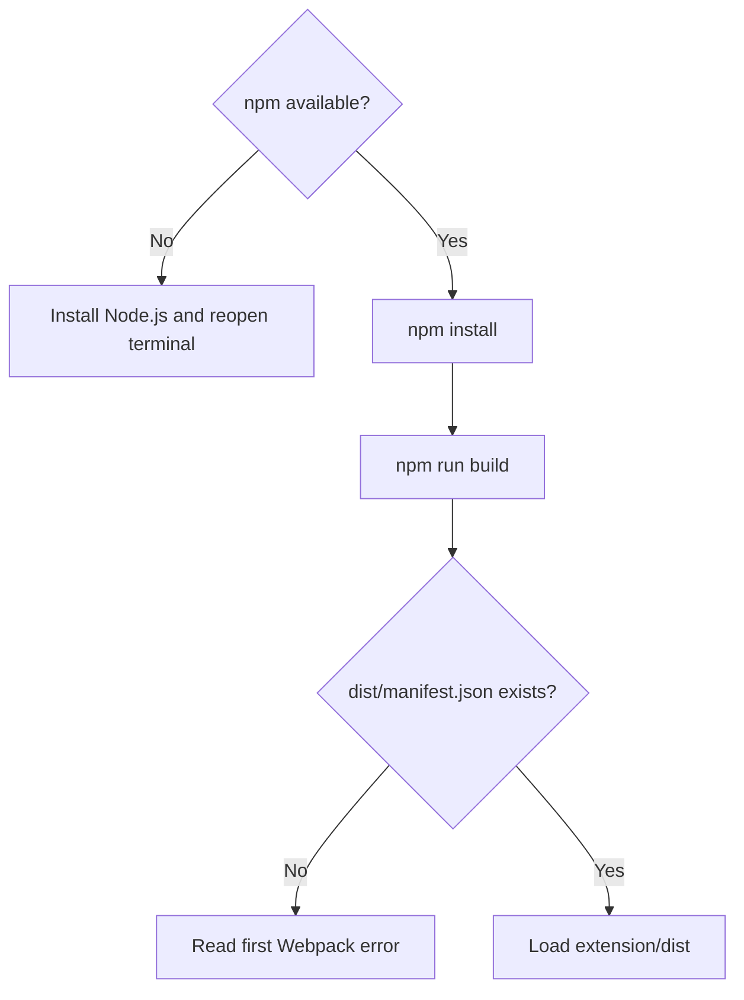
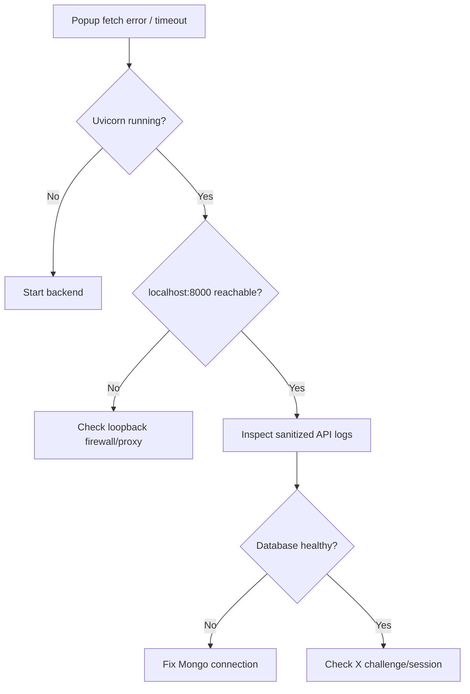
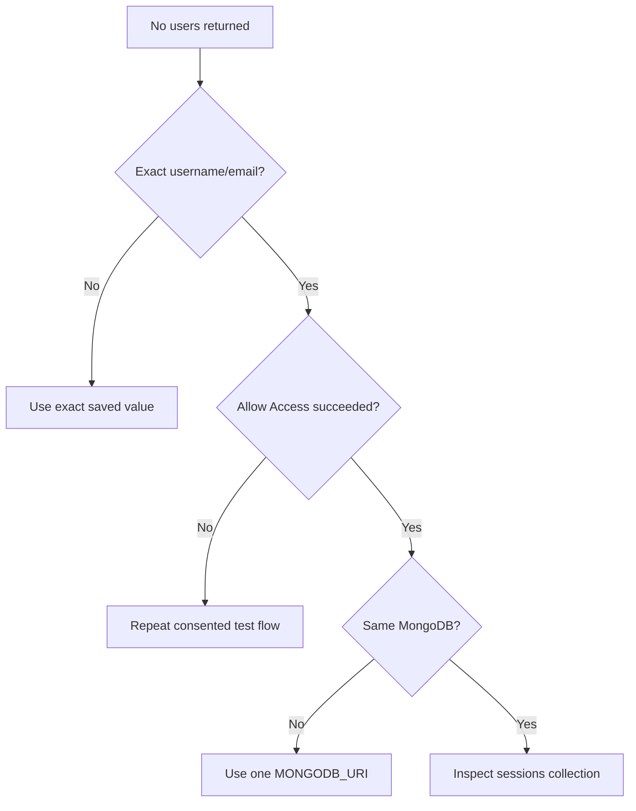
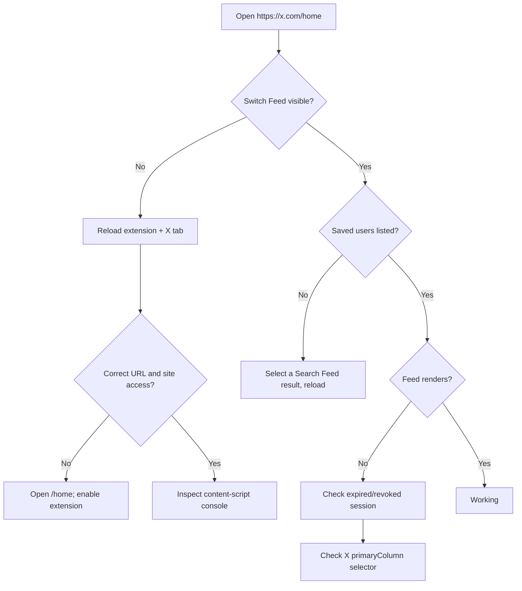
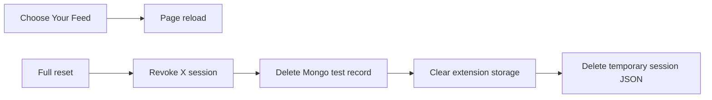

# Troubleshooting

[← README](../README.md) · [User journey](workflows-and-api.md) · [Browser extension](browser-extension.md) · [Backend and API](backend-and-api.md) · [Architecture](architecture.md) · [Security](security-and-privacy.md) · [Setup](setup.md) · [Boundaries](current-boundaries.md)

## Start here



## Backend tree



| Symptom | Check | Fix |
| --- | --- | --- |
| `MONGODB_URI not set` | `.env` location | Put it in `twikit/.env` |
| Mongo connection failure | Service/URI/network | Correct private connection |
| Pip decoding error | Requirements encoding | Convert UTF-16 → UTF-8 only |
| Import error | Active virtual environment | Reinstall requirements |

## Build tree



```bash
node --version
npm --version
cd extension
npm install
npm run build
```

## Request tree



The UI maps several failures to the same message. A generic credential error does not prove the password is wrong.

## Search tree



## X page tree



## Symptom board

| Symptom | Most likely boundary |
| --- | --- |
| Popup opens, fetch fails | Extension → local API |
| Search empty | Exact value or Mongo record |
| Selector absent | Manifest/content-script scope |
| Selector empty | Chrome `userSessions` storage |
| Loading never resolves | API/Twikit/X request |
| Session expired | Revoked or invalid cookies |
| Wrong user after an expiry removal | Stale dropdown indexes; refresh X Home |
| Blank X column | X DOM selector changed |
| Images work, video fails | Media URL/format changed |

## Endpoint failure map

| Endpoint | Common visible result | Important distinction |
| --- | --- | --- |
| `/login` | Generic credential message or timeout | Backend maps file, database, X, and login exceptions to similar failures |
| `/match-sessions` | No matches or fetch error | Search requires exact stored username/email and the same MongoDB |
| `/get-feed` | Session expired or Error loading feed | Parsed non-array/empty data removes local entry; network/parse catch does not |
| `/login-from-file/{username}` | HTTP error | Development endpoint is not part of the extension UI flow |

Read sanitized FastAPI output before concluding that the owner entered incorrect credentials.

## Restore and reset



Removing the extension clears browser-side state, not MongoDB records.

## Safe bug report card

| Include | Never include |
| --- | --- |
| Browser/version | Password |
| Python/Node versions | Cookie values |
| Failing step | `.env` contents |
| Sanitized error | MongoDB URI |
| API/Mongo reachability | Private feed data |
