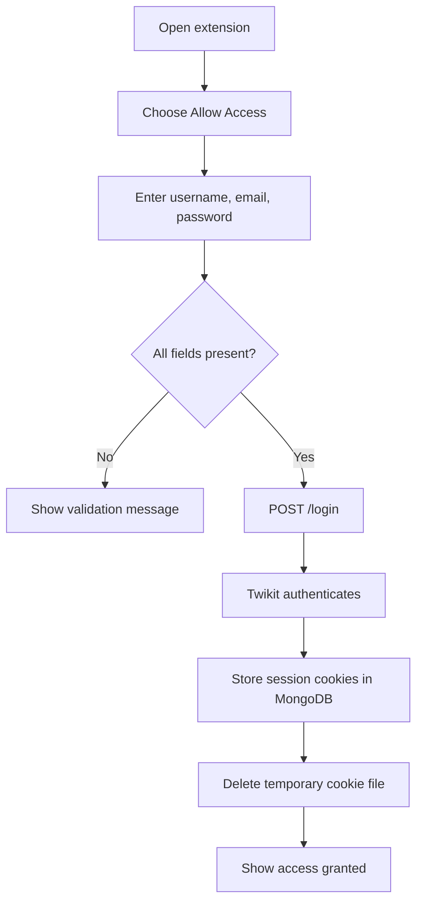
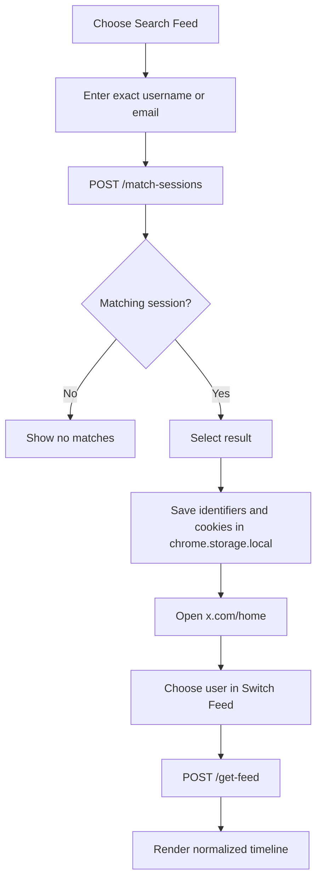

# Workflows and API

[← README](../README.md) · [Architecture](architecture.md) · [Setup](setup.md) · [Security](security-and-privacy.md) · [Troubleshooting](troubleshooting.md)

## Account-owner workflow



The password is sent to the local backend for the login attempt. It is not written into the MongoDB update in the current code, but it still crosses the extension/API boundary and must be treated as highly sensitive.

## Viewer workflow



The browser avoids duplicate local records by comparing the displayed `auth_info` value. There is currently no UI for manually removing a saved entry.

## Feed rendering

The content script requests 20 timeline items from Twikit, while the renderer allows a maximum of 30. Items are appended in batches of 10 as an intersection-observer sentinel becomes visible.

Each normalized item can include:

```json
{
  "author": "Display name",
  "handle": "username",
  "text": "Post text",
  "created_at": "timestamp",
  "likes": 10,
  "retweets": 2,
  "replies": 1,
  "media": ["https://media.example/image.jpg"]
}
```

Images are lazy-loaded. MP4 videos use browser controls, begin muted, and are limited by the script to 30% volume after unmuting.

## API contracts

The service currently exposes no authentication layer. The examples below describe the code; they are not a recommendation to expose these routes beyond localhost.

### `POST /login`

Creates a Twikit session and upserts it by `auth_info_1`.

Request:

```json
{
  "auth_info_1": "x_username",
  "auth_info_2": "owner@example.com",
  "password": "account-password"
}
```

Successful response includes a message and the cookie wrapper. Login failures return HTTP 401. A temporary JSON file is created under `twikit/sessions` and cleanup is attempted in `finally`.

### `POST /match-sessions`

Finds records where either stored identifier exactly equals either submitted value.

Request:

```json
{
  "auth_info_1": "search-value",
  "auth_info_2": "search-value"
}
```

Response:

```json
{
  "matches": [
    {
      "auth_info_1": "x_username",
      "auth_info_2": "owner@example.com",
      "cookies": { "cookies": [] }
    }
  ]
}
```

The route returns cookie material with search results. This is a critical limitation described in [Security and privacy](security-and-privacy.md).

### `POST /get-feed`

Creates a Twikit client from supplied cookie name/value pairs and requests the home timeline.

Request:

```json
{
  "cookies": [
    { "name": "cookie_name", "value": "sensitive_value" }
  ]
}
```

The successful response is an array of normalized feed objects. When an exception occurs before any results are collected, the backend attempts to find and delete the corresponding database record using the first cookie value, then returns HTTP 500.

### `POST /login-from-file/{username}`

Imports cookies from a file resolved relative to the backend's working directory and stores them under the supplied username. This endpoint is development-oriented and is not called by the extension UI.

## Session-expiration behavior

If `/get-feed` produces a non-array or empty response, the content script:

1. Replaces the X primary column with a session-expired message.
2. Removes the selected entry from Chrome local storage.
3. Removes its current selector option.

The account owner must deliberately re-authorize a new session. Previously issued X sessions should be revoked through X security settings when they are no longer needed.

## Current error handling

| Location | Behavior |
| --- | --- |
| Access page | 40-second timeout and a generic credentials/session message |
| Search page | No matches or generic fetch error |
| Feed switcher | Session-expired or loading-error content |
| Backend login | HTTP 401 containing the underlying error text |
| Backend lookup/feed | HTTP 500 on unhandled exceptions |

The UI does not currently distinguish API unavailability, MongoDB failure, X challenge responses, revoked cookies, and ordinary invalid credentials with precise user-facing messages.
