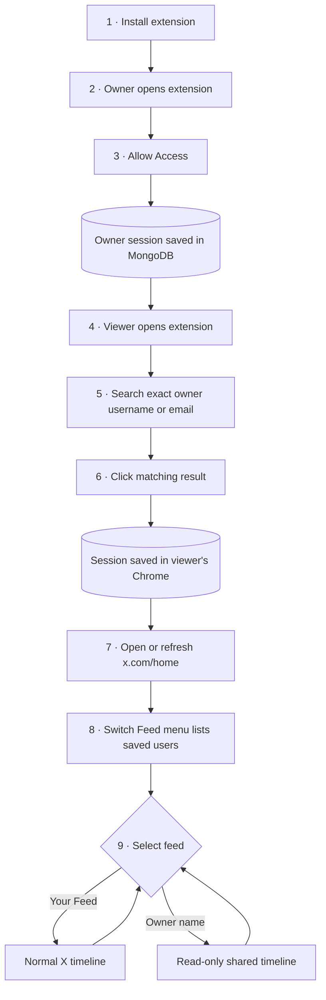
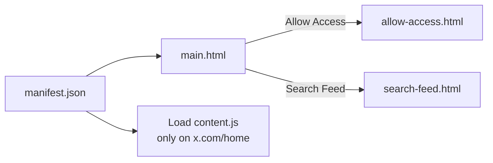
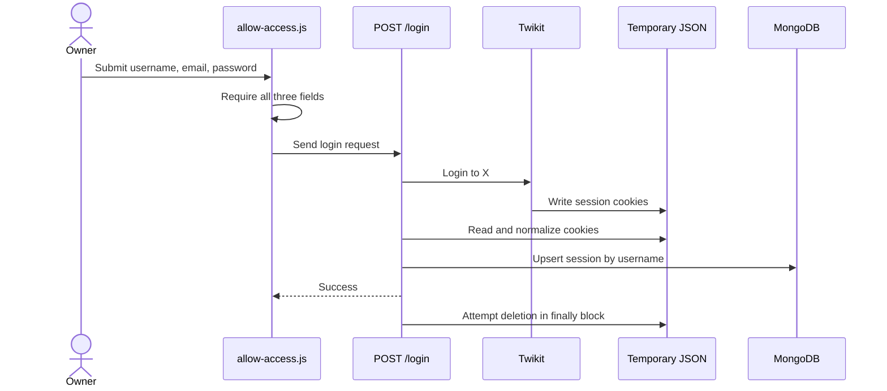
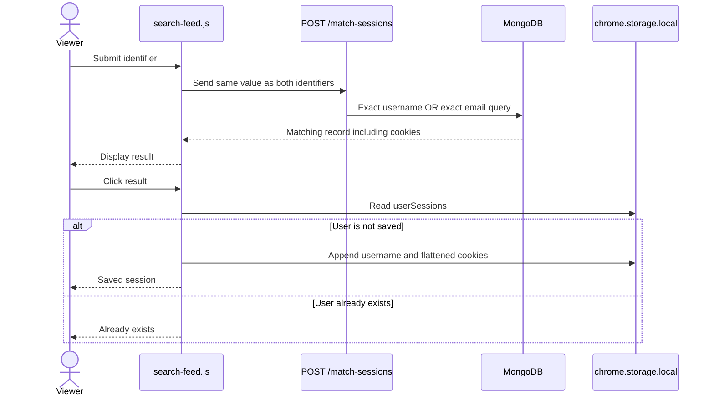
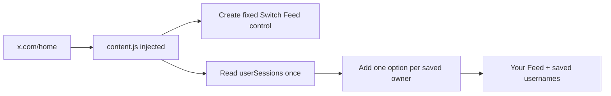
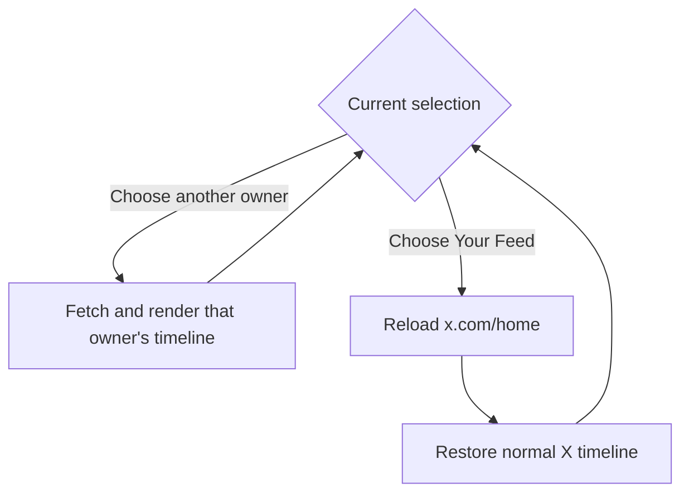
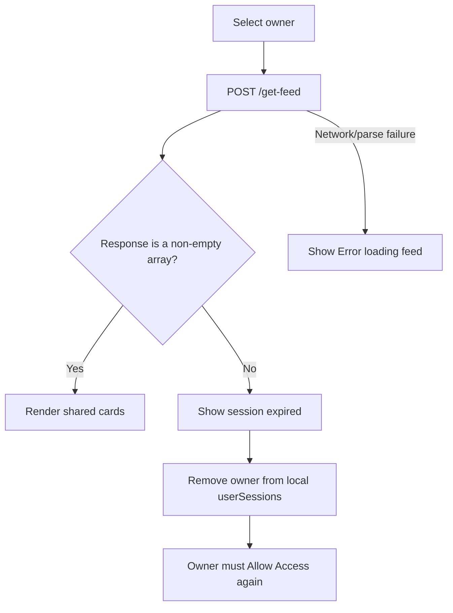

# Workflow and background processing

[← README](../README.md) · [Setup](setup.md) · [Architecture](architecture.md) · [Security](security-and-privacy.md) · [Troubleshooting](troubleshooting.md)

This guide follows the feature in the order it is used. For every visible user action, it shows the processing performed by the extension and backend.

## Roles and terms

| Term | Meaning |
| --- | --- |
| **Owner** | The person whose X home timeline will be shared |
| **Viewer** | The person who searches for, saves, and views that timeline |
| **Your Feed** | The viewer’s normal X home timeline |
| **Shared Feed** | The owner’s X home timeline rendered as read-only cards |
| **Saved user** | An owner session selected by the viewer and stored in that browser |

One person may act as both owner and viewer during a local demo. In the intended journey, they are separate people.

## End-to-end map



## 1 · Install and open the extension

### User action

1. Load the built `extension/dist` directory as an unpacked Chrome extension.
2. Pin the extension if desired.
3. Click its toolbar icon.
4. Choose **Allow Access** or **Search Feed**.

### Background processing



Chrome also gives the extension access to `chrome.storage.local`, where the viewer’s selected users are kept.

## 2 · Owner grants access

### User action

1. Open the extension.
2. Select **Allow Access**.
3. Enter all three values:
   - X username
   - X account email
   - X account password
4. Select **Submit**.
5. Wait for **You have granted access to see your feed.**

The current form does not ask for a separate numeric X user ID.

### Background processing



| Step | System behavior |
| --- | --- |
| Validate | Empty fields stop the request in the popup |
| Submit | Popup calls `POST http://localhost:8000/login` |
| Authenticate | Twikit signs in with username, email, and password |
| Create session | X session cookies are written to a temporary JSON file |
| Normalize | Raw cookie values are converted to a consistent cookie list |
| Persist | MongoDB record is inserted or updated using the username as the key |
| Clean up | Backend attempts to delete the temporary file whether login succeeds or fails |

The password is sent to the local API but is not included in the MongoDB update. The reusable session cookies are persisted and are highly sensitive.

### Resulting database record

```text
twitter_sessions.sessions
└── owner record
    ├── auth_info_1: X username
    ├── auth_info_2: X email
    └── cookies
        └── cookies[]: reusable X session cookie objects
```

At this point the owner is searchable. The viewer has not saved the owner yet.

## 3 · Viewer searches and saves an owner

### User action

1. Open the extension.
2. Select **Search Feed**.
3. Enter the owner’s exact X username or exact email.
4. Select **Submit**.
5. Click the matching username in the result box.
6. Confirm that **Saved session for “username”** appears.

### Background processing



> [!IMPORTANT]
> Search does not save the result automatically. The viewer must click the result.

The search is exact and case-sensitive according to the stored MongoDB values. It does not perform partial matching, suggestions, or a live X user search.

### Resulting browser record

```text
chrome.storage.local
└── userSessions[]
    ├── auth_info: displayed username
    └── cookies[]: cookie name/value objects used for feed requests
```

Each clicked owner is appended to `userSessions`, unless the same displayed username is already present. This array becomes the list shown in the Switch Feed menu.

## 4 · Viewer opens X Home

### User action

1. Sign in to the viewer’s own X account normally.
2. Open `https://x.com/home`.
3. If the owner was saved while this page was already open, refresh it once.
4. Find **Switch Feed** in the top-right corner.

### Background processing



The content script runs only when the hostname is `x.com` and the path is `/home`. It reads saved users when the page initializes; it does not listen for later storage changes. That is why a refresh is required after adding a new user to an already-open X Home tab.

## 5 · Viewer selects a shared feed

### User action

1. Open **Switch Feed**.
2. Select a saved owner.
3. Wait while the main X timeline is replaced.
4. Scroll through the shared timeline.

### Background processing

```mermaid
sequenceDiagram
    actor Viewer
    participant Menu as Switch Feed
    participant Page as X primary column
    participant Local as Chrome storage
    participant API as POST /get-feed
    participant Twikit
    participant X

    Viewer->>Menu: Select saved owner
    Menu->>Page: Clear current column; show Loading
    Menu->>Local: Read selected owner's cookies
    Menu->>API: Send cookie name/value list
    API->>Twikit: Set session cookies
    Twikit->>X: Request home timeline, count 20
    X-->>API: Posts
    API->>API: Normalize text, author, time, counts, media
    API-->>Page: Timeline JSON
    Page->>Page: Render custom cards in batches of 10
```

The extension replaces the element matching `[data-testid="primaryColumn"]`. It does not navigate the viewer into the owner’s X account UI.

### Shared card contents

```text
┌─────────────────────────────────────────────┐
│ @handle — created time                      │
│                                             │
│ [image or video, when available]            │
│                                             │
│ Post text                                   │
│ ❤️ likes  |  🔁 reposts  |  💬 replies      │
└─────────────────────────────────────────────┘
```

| Included | Not included |
| --- | --- |
| Author handle and time | Like button |
| Text | Reply field/button |
| Images and MP4 video | Repost button |
| Like/repost/reply counts | Follow or message actions |

This makes the injected shared-feed view read-only in the UI. It is not a backend security boundary: the current prototype still transfers reusable session cookies.

## 6 · Viewer switches back or changes owner



- Selecting another saved owner replaces the current shared feed with the newly selected one.
- Selecting **Your Feed** reloads the page because the original X timeline DOM was cleared during replacement.
- Saved owners remain in Chrome storage between page loads and browser restarts until removed, expired, or the extension’s data is cleared.

## 7 · Expired and failed sessions



When timeline retrieval fails before any result is created, the backend also attempts to find and delete the matching MongoDB session. The viewer may therefore need the owner to grant access again before search can find that account.

## API reference

| Endpoint | Called from | Input | Main processing | Output |
| --- | --- | --- | --- | --- |
| `POST /login` | Allow Access | Username, email, password | X login, cookie normalization, MongoDB upsert | Success message and cookie wrapper |
| `POST /match-sessions` | Search Feed | Same search value in two identifier fields | Exact MongoDB username/email match | Matching identifiers and cookies |
| `POST /get-feed` | X Home content script | Selected cookie name/value list | Load X home timeline and normalize posts | Timeline array |
| `POST /login-from-file/{username}` | Not called by extension UI | Backend file path derived from username | Import cookie JSON into MongoDB | Imported session message |

### `POST /login`

```json
{
  "auth_info_1": "x_username",
  "auth_info_2": "owner@example.com",
  "password": "account-password"
}
```

### `POST /match-sessions`

```json
{
  "auth_info_1": "exact-search-value",
  "auth_info_2": "exact-search-value"
}
```

### `POST /get-feed`

```json
{
  "cookies": [
    { "name": "cookie_name", "value": "sensitive-value" }
  ]
}
```

### Normalized timeline item

```json
{
  "author": "Display name",
  "handle": "username",
  "text": "Post text",
  "created_at": "timestamp",
  "likes": 10,
  "retweets": 2,
  "replies": 1,
  "media": ["https://media.example/image.jpg"]
}
```

Never use real passwords or cookie values in documentation, screenshots, logs, issues, or test fixtures.
