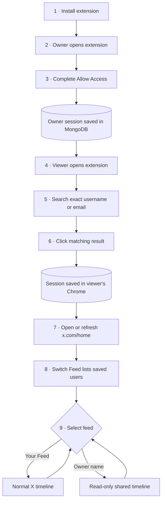
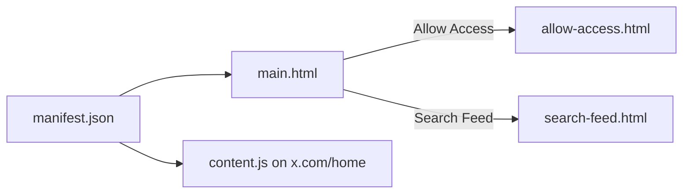
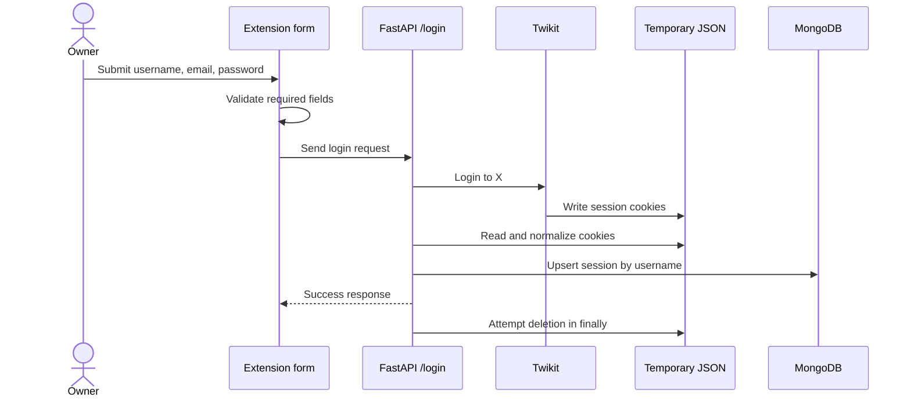
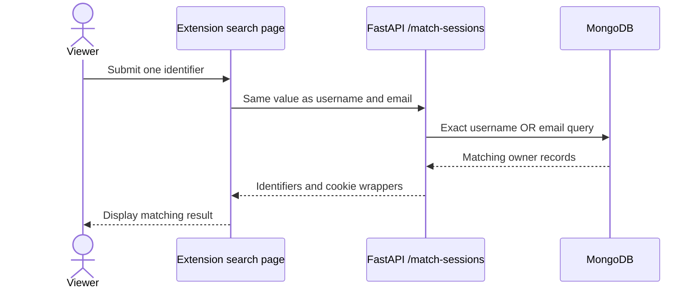
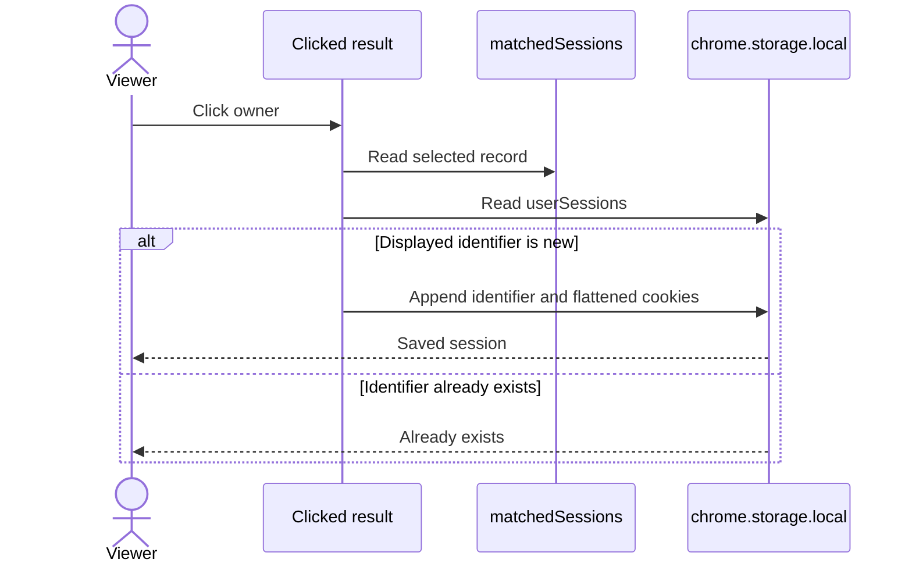
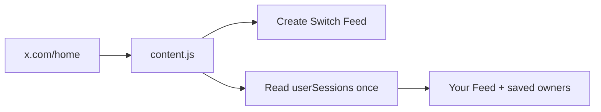
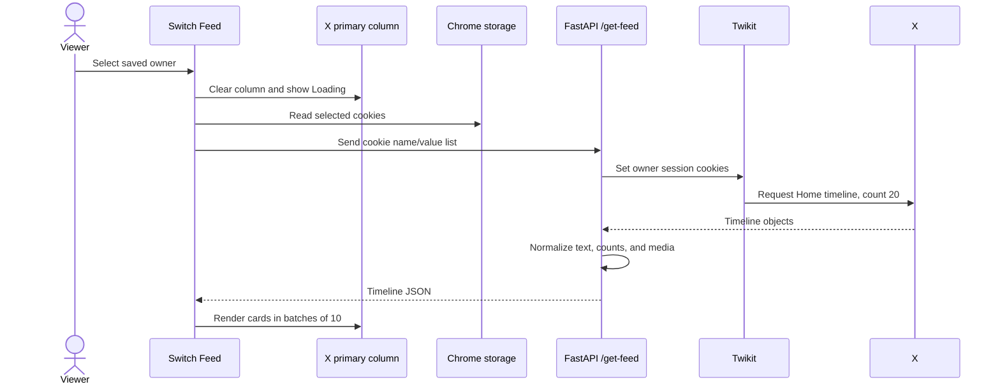
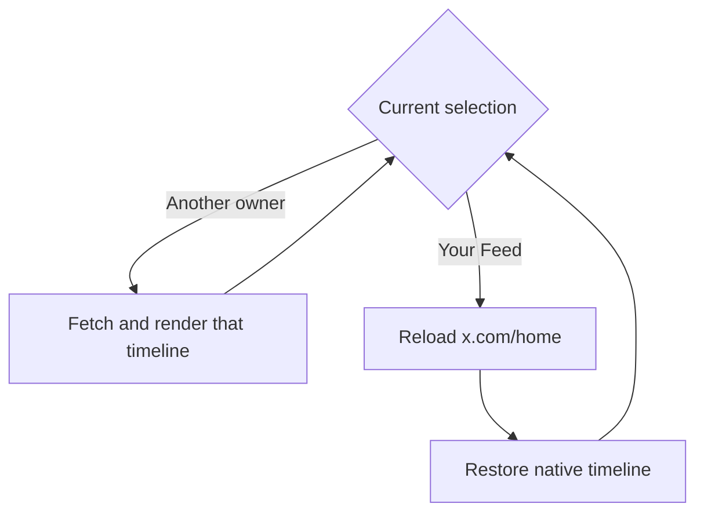
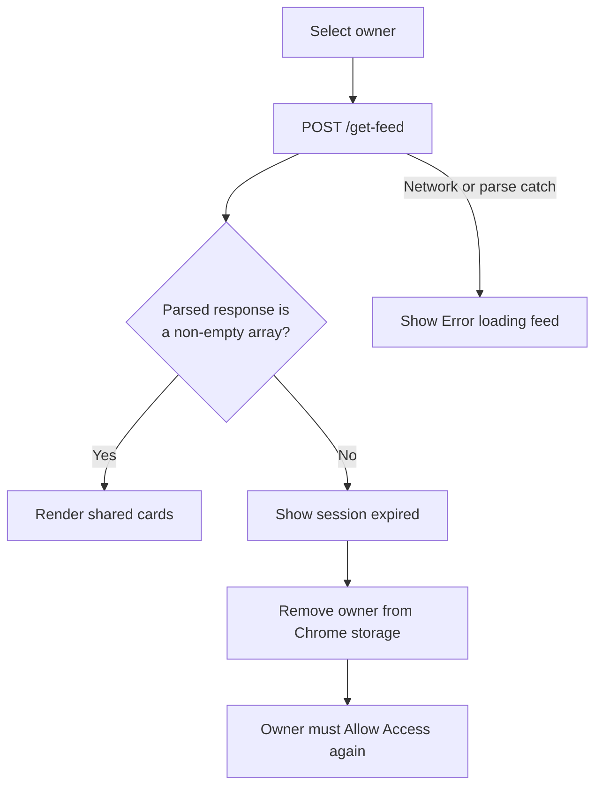
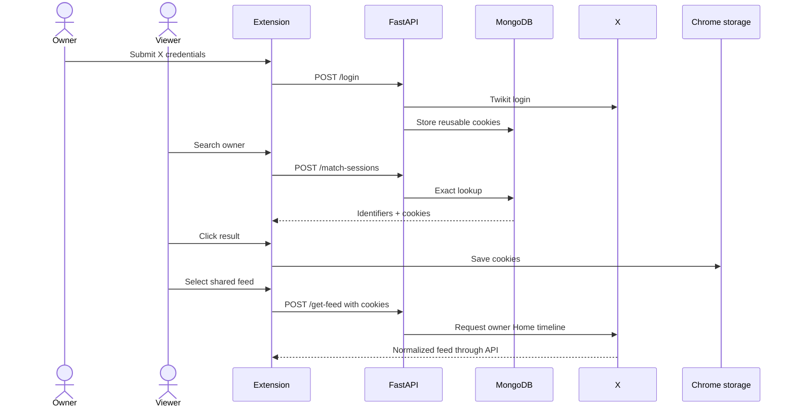

# User journey and feature handoffs

[← README](../README.md) · [Browser extension](browser-extension.md) · [Backend and API](backend-and-api.md) · [Architecture](architecture.md) · [Security](security-and-privacy.md) · [Setup](setup.md) · [Troubleshooting](troubleshooting.md) · [Boundaries](current-boundaries.md)

This guide follows the feature in the order it is used. For every visible owner or viewer action, it shows where control passes between the extension, FastAPI, Twikit, MongoDB, Chrome storage, and X.

## Roles and terms

| Term | Meaning |
| --- | --- |
| **Owner** | The person whose X Home timeline will be shared |
| **Viewer** | The person who searches for, saves, and views that timeline |
| **Your Feed** | The viewer’s normal X Home timeline |
| **Shared Feed** | The owner’s X Home timeline rendered as custom read-only cards |
| **Saved user** | An owner session selected by the viewer and stored in that browser |
| **Owner record** | Username, email, and wrapped session cookies stored in MongoDB |

One person may act as both owner and viewer during a local demonstration. In the intended journey, they are separate people using extension builds connected to the same backend and MongoDB database.

## Complete journey



## Journey checkpoints

| Stage | Actor action | Main processing | Successful result |
| --- | --- | --- | --- |
| 1. Install | Load `extension/dist` | Chrome reads Manifest V3 declarations | Popup and X Home content script are available |
| 2. Open | Select the extension icon | `main.html` presents two journey choices | Owner or viewer can continue |
| 3. Grant | Submit username, email, and password | FastAPI/Twikit logs in, normalizes cookies, and upserts MongoDB | Owner becomes searchable |
| 4. Search | Enter exact username or email | FastAPI queries MongoDB | Matching owner appears |
| 5. Save | Click the matching result | Extension flattens cookies into `userSessions` | Owner is stored in viewer’s Chrome |
| 6. Open Home | Visit or refresh `x.com/home` | Content script creates Switch Feed and reads storage | Saved owners appear in menu |
| 7. Select | Choose a saved owner | FastAPI/Twikit loads owner’s X Home timeline | Normalized timeline returns |
| 8. Read | Scroll shared feed | Content script renders batches of custom cards | Read-only shared view appears |
| 9. Restore | Choose Your Feed | Content script reloads X Home | Native viewer timeline returns |

## 1 · Install and open

### User action

1. Build the extension.
2. Load `extension/dist` as an unpacked Chrome extension.
3. Pin it if desired.
4. Select its toolbar icon.
5. Choose **Allow Access** or **Search Feed**.

### Feature handoff



Chrome also grants access to `chrome.storage.local`, where viewer-selected owner sessions are kept.

For manifest, popup, and build details, read [Browser extension](browser-extension.md).

## 2 · Owner grants access

### User action

1. Open the extension.
2. Select **Allow Access**.
3. Enter the X username, account email, and account password.
4. Select **Submit**.
5. Wait for **You have granted access to see your feed.**

The form requires all three values and does not ask for a separate numeric X user ID.

### Feature handoff



### What is stored

```text
twitter_sessions.sessions
└── owner record
    ├── auth_info_1: X username
    ├── auth_info_2: X email
    └── cookies
        └── cookies[]: reusable X session cookie objects
```

The password is sent to the local API and Twikit but is not included in the MongoDB update. The reusable cookies are persisted and are highly sensitive.

At this point, the owner is searchable. No viewer has saved the owner yet.

## 3 · Viewer searches for an owner

### User action

1. Open the extension.
2. Select **Search Feed**.
3. Enter the owner’s exact username or exact email.
4. Select **Submit**.

### Feature handoff



Search uses exact stored values. It does not provide partial matching, suggestions, case normalization, or a live X directory lookup.

## 4 · Viewer saves the result

### User action

1. Click the matching username in the result box.
2. Confirm that **Saved session for “username”** appears.

> [!IMPORTANT]
> Search does not save the result automatically. Clicking it is a separate required action.

### Feature handoff



### Browser record

```text
chrome.storage.local
└── userSessions[]
    ├── auth_info: displayed username
    └── cookies[]: cookie name/value objects
```

The username falls back to email if the username value is absent. Duplicate displayed identifiers are not added twice.

## 5 · Viewer opens X Home

### User action

1. Sign in to the viewer’s own X account normally.
2. Open `https://x.com/home`.
3. Refresh once if the owner was saved while the page was already open.
4. Find **Switch Feed** in the top-right corner.

### Feature handoff



The content script checks both the `x.com` hostname and `/home` pathname. It reads saved users only at initialization, so later storage changes require a refresh.

## 6 · Viewer selects a shared feed

### User action

1. Open **Switch Feed**.
2. Select a saved owner.
3. Wait while the main timeline is replaced.
4. Scroll through the shared cards.

### Feature handoff



The extension clears `[data-testid="primaryColumn"]`; it does not navigate the viewer into the owner’s native X account interface.

### Shared card contents

| Included | Not included |
| --- | --- |
| Author handle and creation time | Like button |
| Text | Reply field or button |
| Images and MP4 video | Repost button |
| Like, repost, and reply counts | Follow or message actions |

This makes the injected view read-only at the UI layer. It does not make the transferred session a securely scoped read-only credential.

## 7 · Switch back or choose another owner



- Another saved owner replaces the current shared feed.
- **Your Feed** reloads the page because the original X timeline DOM was cleared.
- Saved owners persist between page loads and browser restarts until removed, expired, or extension data is cleared.

## 8 · Expired and failed sessions



When backend timeline processing fails before producing any item, it also attempts to find and delete the MongoDB owner session through the first cookie value. This is best-effort and order-dependent.

The browser removes the saved owner for a parsed non-array or empty response. A network or JSON parsing exception shows an error but keeps the saved entry.

## Complete trust and data handoff



## Where to continue

| If you want to understand… | Read |
| --- | --- |
| Popup pages, manifest, storage, content script, and renderer | [Browser extension](browser-extension.md) |
| FastAPI, Twikit, MongoDB, endpoints, models, and media extraction | [Backend and API](backend-and-api.md) |
| Component ownership and runtime connections | [Architecture](architecture.md) |
| Password, cookie, consent, storage, and revocation risk | [Security and privacy](security-and-privacy.md) |
| Installation and complete verification | [Setup](setup.md) |
| Failure isolation and reset procedures | [Troubleshooting](troubleshooting.md) |
| Known implementation limits and production work | [Current boundaries](current-boundaries.md) |
