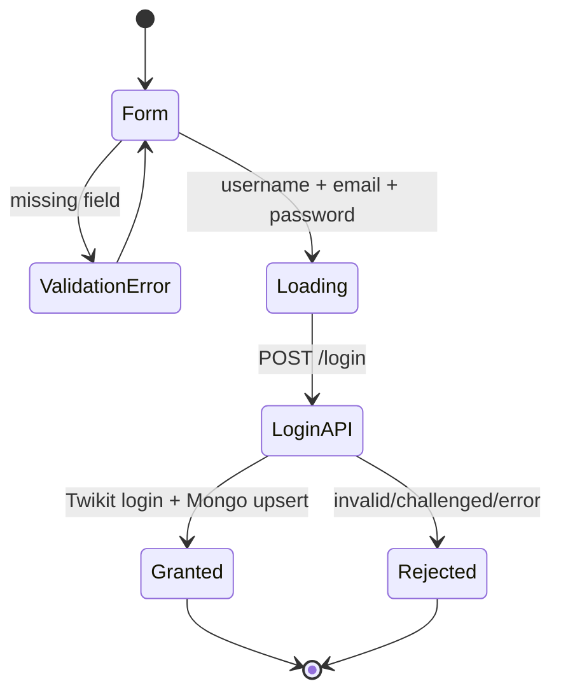
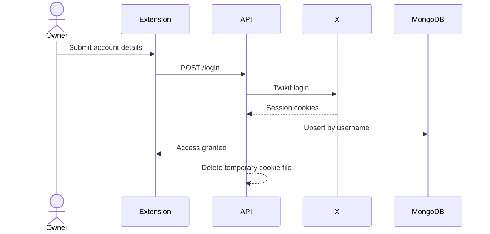
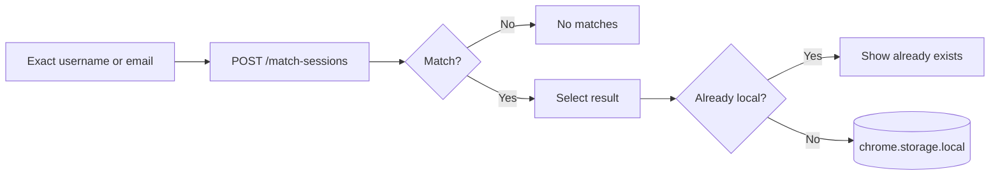
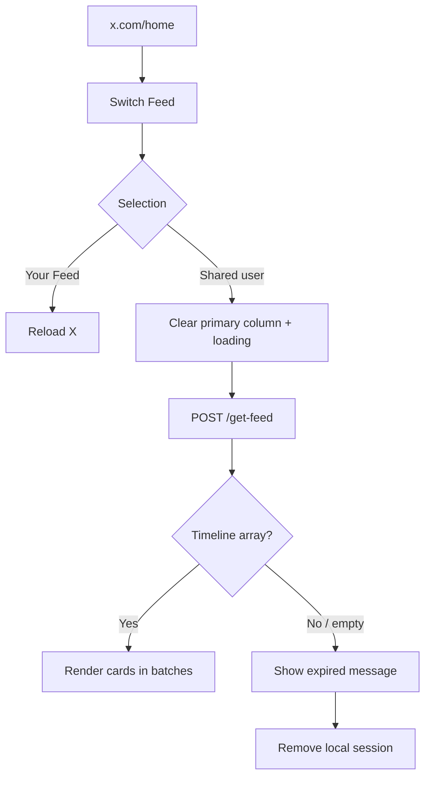
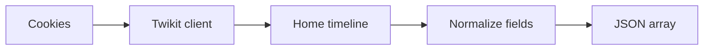
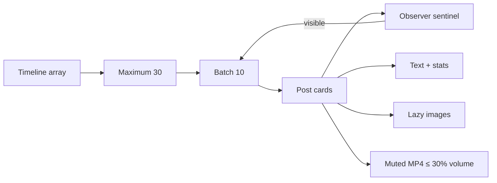

# Workflows and API

[← README](../README.md) · [Architecture](architecture.md) · [Setup](setup.md) · [Security](security-and-privacy.md) · [Troubleshooting](troubleshooting.md)

## Journey 1 · Allow access





> [!WARNING]
> The password is transient but still crosses the extension/API boundary. Cookies persist in MongoDB.

## Journey 2 · Find a feed



## Journey 3 · Switch feed



## API map

```mermaid
flowchart LR
    Extension --> Login[POST /login]
    Extension --> Match[POST /match-sessions]
    Extension --> Feed[POST /get-feed]
    Dev[Development only] --> File[POST /login-from-file/{username}]

    Login --> Mongo[(MongoDB)]
    Match --> Mongo
    Feed --> X[X via Twikit]
    File --> Mongo

    style Match fill:#fee2e2,stroke:#dc2626
    style File fill:#fef3c7,stroke:#d97706
```

| Endpoint | Takes | Returns | Called by UI? |
| --- | --- | --- | --- |
| `POST /login` | Two identifiers + password | Message + cookie wrapper | Yes |
| `POST /match-sessions` | Search value twice | Matches including cookies | Yes |
| `POST /get-feed` | Cookie name/value list | Normalized timeline array | Yes |
| `POST /login-from-file/{username}` | Path parameter | Imported session | No |

## Payload cards

### `/login`

```json
{
  "auth_info_1": "x_username",
  "auth_info_2": "owner@example.com",
  "password": "account-password"
}
```

```text
request → Twikit login → normalize cookies → Mongo upsert → temporary-file cleanup
```

### `/match-sessions`

```json
{
  "auth_info_1": "search-value",
  "auth_info_2": "search-value"
}
```

```text
exact match → auth_info_1 OR auth_info_2 → session identifiers + raw cookies ⚠️
```

### `/get-feed`

```json
{
  "cookies": [
    { "name": "cookie_name", "value": "sensitive_value" }
  ]
}
```



### Normalized timeline item

```json
{
  "author": "Display name",
  "handle": "username",
  "text": "Post text",
  "created_at": "timestamp",
  "likes": 10,
  "retweets": 2,
  "replies": 1,
  "media": ["https://media.example/image.jpg"]
}
```

## Rendering pipeline



## Error matrix

| Stage | Current UI result | Backend result |
| --- | --- | --- |
| Missing field | Fill-all-fields message | No request |
| Login timeout | Logout/retry message | Request may continue |
| Login failure | Generic credential message | HTTP 401 |
| No search match | No matches | Empty array |
| Search fetch failure | Generic fetch error | HTTP 500/network |
| Empty feed | Session-expired message | Record may be deleted |
| Feed failure | Error loading feed | HTTP 500 |

The UI intentionally stays simple, so several different backend failures look identical to the user.
